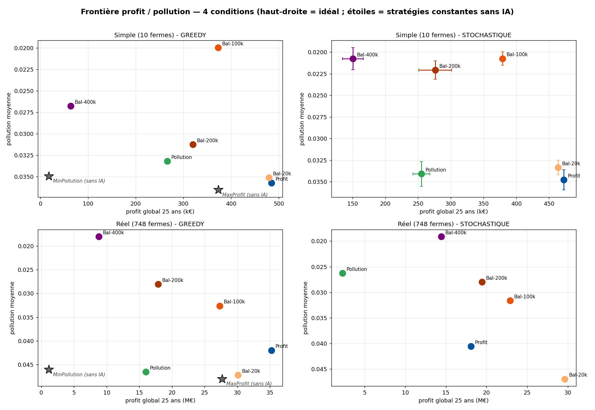
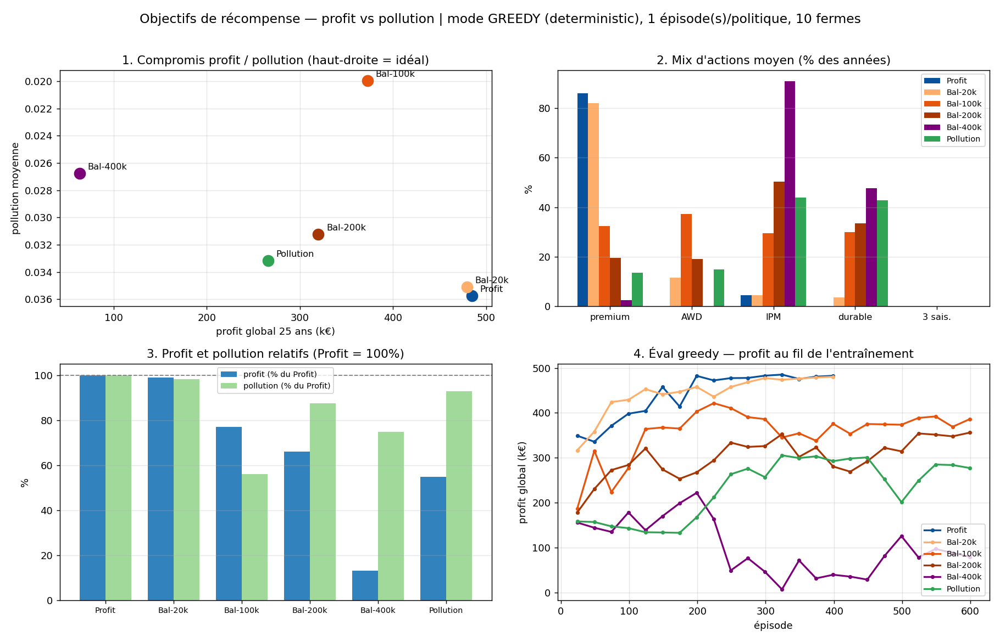
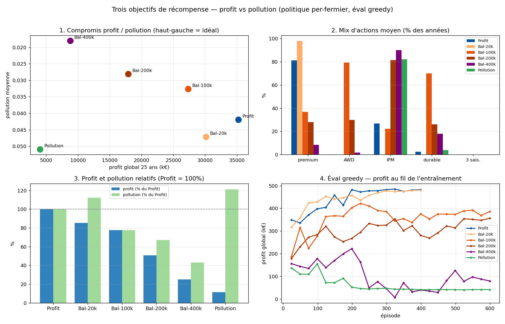
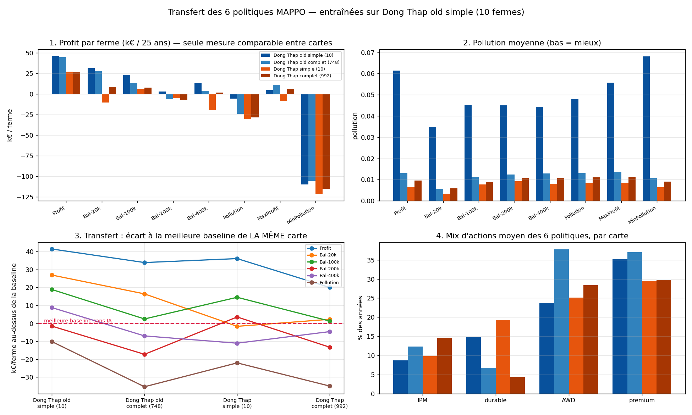

# Bilan global : pilotage par IA multi-agents de la simulation Starfarm

*Projet Starfarm, apprentissage par renforcement multi-agents (MARL). Juillet 2026.*

Ce document est le bilan de l'ensemble du travail RL mené sur la simulation rizicole
Starfarm : ce qui a été construit, ce que les expériences montrent, ce que l'IA a révélé du
modèle lui-même, et ce qui reste à faire. Il est organisé par questions ; le cheminement
chronologique (choix, impasses, corrections) est résumé en annexe A. Chaque section renvoie
aux rapports et fichiers Excel détaillés (annexe B). Les aspects purement algorithmiques
sont couverts par la note technique en anglais `note_methodo_rl.pdf`, destinée aux experts RL.

## Résumé exécutif

> **À lire avant les chiffres.** Les sections 2 à 4 rapportent des mesures antérieures à la
> recalibration du modèle et à l'arrivée de la province `Dong Thap`. Les valeurs à jour sont
> en **section 8** et **annexe C**, et ne sont pas comparables à celles-ci : la recalibration
> a modifié l'économie du modèle (la stratégie constante MaxProfit passe de 373 k à 47 k de
> profit à 10 fermes, MinPollution change de signe). Les conclusions **2** et **3** ci-dessous
> sont corrigées en section 8.

Six politiques d'IA ont été entraînées sur la carte simplifiée (10 fermes, 25 ans simulés),
avec un seul facteur variable : l'objectif de récompense (profit ; pollution ; ou un
compromis profit moins lambda fois pollution, pour quatre valeurs de lambda). Elles ont
ensuite été évaluées sans réentraînement sur la carte réelle (748 fermes), en décision
déterministe (greedy) et échantillonnée (stochastique), et confrontées à deux stratégies
constantes sans IA. Quatre conclusions principales :

1. **L'IA apporte une valeur mesurable, et cette valeur est temporelle plus
   qu'agronomique.** La politique Profit bat la meilleure stratégie constante (tout le
   monde en premium, en continu) de +30 % à 10 fermes et +27 % à 748 fermes, à pratiques
   agricoles identiques : elle gagne en modulant l'adoption du premium au rythme du marché,
   pas en cultivant mieux.

2. **Le compromis profit / pollution est pilotable par un seul paramètre.** Le poids lambda
   trace une frontière exploitable : lambda = 100k conserve 77 % du profit en réduisant la
   pollution de 22 à 44 % selon l'échelle ; lambda = 400k réduit la pollution de 57 % en
   conservant 25 % du profit. A l'inverse, l'objectif "pollution seule" échoue : il est
   dominé par les politiques équilibrées dans toutes les conditions testées.
   **Conclusion revue en section 8.3** : le balayage n'ayant reçu qu'une graine et un budget
   fixe par valeur de lambda, il ne permet pas d'établir la forme de cette frontière.

3. **Le passage à l'échelle fonctionne.** L'architecture (acteur partagé sans identifiant
   d'agent) transfère de 10 à 748 fermes sans réentraînement, et la hiérarchie des
   politiques y devient plus propre qu'à petite échelle. En contrepartie, l'écart entre
   décision déterministe et échantillonnée, négligeable à 10 fermes, devient un facteur de
   premier ordre à 748 (jusqu'à -49 % de profit pour la politique Profit).
   **À préciser depuis, section 8.2** : c'est vrai pour l'**échelle** (97 % du profit par ferme
   conservé, sur deux provinces) mais faux pour la **province** — cinq politiques sur six
   perdent leur avantage en changeant de carte, trois passent sous la stratégie sans IA.

4. **L'IA est aussi un outil d'audit du modèle.** Trois faiblesses de modélisation ont été
   mises en évidence par l'entraînement : la pollution ne provient que des pesticides
   (l'irrigation AWD et la fertilisation durable n'y contribuent pas) ; l'observation de
   rendement est aveugle en calendrier 3 saisons ; et le choix "3 saisons" est rejeté par
   toutes les politiques, probablement en partie à cause de ces défauts.

*La figure de synthèse : chaque point est une politique entraînée, chaque étoile grise une
stratégie constante sans IA. Haut-droite = idéal (profit haut, pollution basse). Les
étoiles sont dominées dans tous les panneaux où elles figurent.*

## 1. Le dispositif en bref

**La simulation.** Starfarm (GAMA) simule des exploitations rizicoles du delta du Mékong :
parcelles, sols, ravageurs, salinité, pollution, marché du riz avec rétroaction des prix.
Deux cartes : simplifiée (10 fermes, utilisée pour l'entraînement) et réelle (748 fermes,
utilisée pour tester le transfert). Un épisode = 25 années de culture.

*Depuis la recalibration, une seconde province est disponible et le dispositif compte donc
**quatre cartes** : `Dong Thap old` (10 / 748 fermes) et `Dong Thap` (10 / 992). La distinction
entre changement d'**échelle** et changement de **province** est le résultat central de la
section 8.*

**Ce que l'IA décide.** Chaque ferme, chaque année, choisit 6 leviers : régime d'irrigation
(inondation continue CF ou alternance AWD) et son intensité ; régime de pesticides
(conventionnel BAU ou lutte intégrée IPM) ; fertilisation (BAU ou durable) ; cultivar
(standard OM5451 ou premium ST25, mieux payé mais dont le prix chute si trop de fermes le
choisissent) ; et nombre de saisons de culture (2 ou 3).

**Ce que l'IA observe.** 18 grandeurs par ferme : état local (profit de l'année précédente,
santé du sol, rendement, engrais appliqué, pollution et salinité de la cellule),
descripteurs statiques de la ferme (nombre de parcelles, surface), signaux de marché
globaux (part de riz premium dans le paysage, prix relatif du premium), position dans le
tour de décision, et repères temporels (dont l'indice de l'année dans l'épisode).

**Les décisions sont séquentielles.** Chaque année, les fermes décident une par une dans un
ordre aléatoire, en voyant la part de premium déjà engagée par celles qui ont décidé avant.
C'est ce qui permet à une politique partagée par toutes les fermes de se différencier :
sans cela, toutes prendraient la même décision et le marché premium s'effondrerait
(problème classique de coordination type "El Farol").

**L'algorithme.** MAPPO : un acteur gaussien unique partagé par toutes les fermes (aucun
identifiant d'agent en entrée, ce qui rend le transfert d'échelle possible) et un critique
centralisé qui voit l'état global pendant l'entraînement uniquement. Récompense annuelle
densifiée par sous-étapes saisonnières, actualisation ajustée à la durée réelle des pas.
Détails, hyperparamètres et justifications dans `note_methodo_rl.pdf`.

**Les six politiques comparées.** Profit (récompense = profit par ferme) ; Pollution
(récompense = moins la pollution) ; et quatre politiques équilibrées Bal-20k, Bal-100k,
Bal-200k, Bal-400k (récompense = profit moins lambda fois pollution, lambda croissant).
Entraînements de 600 à 800 épisodes selon les runs, même pipeline pour tous.

*Ces budgets sont ceux des entraînements **pré-recalibration** décrits dans les sections 2 à 4.
Les runs rejoués après recalibration (sections 8 et 9, annexe C) sont tous à **400 épisodes** —
c'est ce budget-là, uniforme et fixé d'avance, que la section 8.3 identifie comme insuffisant
pour les valeurs élevées de lambda.*

## 2. Question 1 : l'IA apporte-t-elle quelque chose ?

C'est la question préalable à toute la suite, et elle exige un point de comparaison
extérieur : des stratégies **sans IA**. Deux stratégies constantes ont été évaluées, où
chaque ferme applique le même paquet de pratiques chaque année, quoi qu'il arrive :

- **MaxProfit (sans IA)** : 100 % premium pour tout le monde, sur le paquet conventionnel
  vers lequel la politique Profit a elle-même convergé (CF à lame d'eau minimale, BAU,
  2 saisons). C'est la lecture littérale de "tout le monde à fond sur ce qui rapporte".
- **MinPollution (sans IA)** : 100 % des pratiques vertes en continu (AWD doux, IPM,
  fertilisation durable, cultivar standard, 2 saisons).

| Stratégie | Profit 10 fermes | Pollution | Profit 748 fermes | Pollution |
|---|---:|---:|---:|---:|
| Profit (IA) | **484,7 k** | 0,0357 | **35,22 M** | 0,0420 |
| MaxProfit (sans IA) | 373,2 k | 0,0365 | 27,69 M | 0,0480 |
| Bal-100k (IA) | 372,8 k | **0,0200** | 27,30 M | **0,0326** |
| MinPollution (sans IA) | 18,1 k | 0,0350 | 1,19 M | 0,0460 |

*Mesures **pré-calibration**. Valeurs à jour en annexe C, non comparables à celles-ci.*

**Premier résultat : +30 % de profit à 10 fermes, +27 % à 748, par le seul timing.** La
stratégie MaxProfit n'échoue pas agronomiquement : ses sols restent sains (0,99) et ses
rendements normaux (5,0 t/ha). Elle échoue économiquement, parce que 100 % de premium en
permanence sature le marché et écrase le prix. La politique Profit adopte les mêmes
pratiques agricoles, mais module le taux de premium (86 % en moyenne, pas 100 %) : elle
sort du premium quand le prix casse et y revient ensuite. Toute sa valeur ajoutée est là.

*Post-calibration, l'écart est bien plus large que ces +30 % : Profit atteint 46,2 k€/ferme
contre 4,7 pour MaxProfit à 10 fermes, soit un facteur ~10 (annexe C). Le résultat est donc
renforcé, mais le raisonnement ci-dessus — « MaxProfit n'échoue pas agronomiquement, elle
échoue économiquement » — s'appuie sur des chiffres qui ne sont plus ceux du modèle actuel et
resterait à re-vérifier sur les données à jour.*

**Deuxième résultat, plus contre-intuitif : cocher toutes les pratiques vertes ne dépollue
presque pas.** MinPollution ne réduit la pollution que de 4 % par rapport à MaxProfit
(0,0365 vers 0,0350 à 10 fermes ; 0,0480 vers 0,0460 à 748), en sacrifiant 95 % du profit.
Pendant ce temps, Bal-100k atteint le **même profit que MaxProfit avec 32 % de pollution en
moins** à 748 fermes, et Bal-400k fait 7,4 fois le profit de MinPollution avec 2,5 fois
moins de pollution. Les deux stratégies constantes sont dominées au sens de Pareto, aux
deux échelles.

L'interprétation tient en une phrase : **dans ce modèle, dépolluer n'est pas une question
de pratiques mais de déclenchement**. La pollution vient des pulvérisations ; ce qui compte
est de pulvériser peu quand la pression ravageur le permet, ce que seule une politique qui
lit l'état du système sait faire.

### 2.1 La preuve micro : les fermes suivent le marché

L'évaluation ferme par ferme montre le mécanisme à l'oeuvre au niveau individuel. Sur un épisode de la
politique Profit, on observe des cycles nets : les premières années, toutes les fermes sont
en premium ; le prix se dégrade, les résultats s'écroulent, et la majorité bascule en
standard ; le prix du premium se reconstitue, et le paysage rebascule en premium. Ces
vagues d'adoption et de retrait, ferme par ferme, sont la signature visible de la
coordination temporelle qui explique l'écart avec la stratégie constante.

## 3. Question 2 : peut-on piloter le compromis profit / pollution ?

Une fois établi que l'IA maximise correctement le profit, la question opérationnelle
devient : peut-on lui faire viser autre chose, et avec quel contrôle ? Le levier testé est
le poids lambda dans la récompense "profit moins lambda fois pollution".

| Politique | Profit (10 fermes) | Pollution | Premium | AWD | IPM | Durable |
|---|---:|---:|---:|---:|---:|---:|
| Profit | **484,7 k** | 0,0357 | 86 % | 0 % | 4 % | 0 % |
| Bal-20k | 479,5 k (99 %) | 0,0351 | 82 % | 12 % | 4 % | 4 % |
| **Bal-100k** | 372,8 k (77 %) | **0,0200 (-44 %)** | 32 % | 37 % | 30 % | 30 % |
| Bal-200k | 319,9 k (66 %) | 0,0312 | 20 % | 19 % | 50 % | 34 % |
| Bal-400k | 63,4 k (13 %) | 0,0268 | 2 % | 0 % | 91 % | 48 % |
| Pollution | 265,9 k (55 %) | 0,0332 | 14 % | 15 % | 44 % | 43 % |

*Mesures **pré-calibration**. Valeurs à jour en annexe C, non comparables à celles-ci.*

**Le curseur lambda fonctionne, avec un seuil.** En dessous d'environ 58 000 (valeur
estimée par calcul sur les ordres de grandeur des deux termes), le terme de pollution est
négligeable et la politique se comporte comme Profit (c'est le cas de Bal-20k). Au-delà, le
compromis s'installe. A 10 fermes, Bal-100k est le point remarquable : pour -23 % de
profit, -44 % de pollution, via un mix équilibré (environ un tiers de premium, d'AWD,
d'IPM et de durable). Il domine même les politiques plus contraintes (200k, 400k) sur les
deux axes à la fois à cette échelle.

**L'échec instructif : la politique "pollution seule".** Entraînée uniquement à minimiser
la pollution, elle devrait être la meilleure sur cet axe. Elle ne l'est nulle part. Son
premier entraînement avait convergé vers un optimum dégénéré (IPM seul, quasi aucune autre
pratique) ; réentraînée avec un taux d'apprentissage réduit, elle adopte un mix plausible
mais reste battue par Bal-100k sur son propre objectif (0,0332 contre 0,0200), et son
transfert à 748 fermes est mauvais (0,0465, pire que la politique Profit). Hypothèses,
détaillées dans `rapport_complet.pdf` :

1. **Signal trop plat** : la pollution varie peu et lentement entre actions ; le gradient
   d'apprentissage est faible et l'exploration s'effondre. Le terme de profit du Balanced
   agit comme un guide d'exploration (reward shaping) qui découvre au passage les régimes
   peu polluants.
2. **Attribution du mérite difficile** : la pollution d'une ferme dépend de ses
   pulvérisations passées et de la diffusion depuis les voisines ; le lien action vers
   récompense est retardé et brouillé.
3. **Externalité collective** : réduire sa pollution profite d'abord aux voisins
   (diffusion), ce qui affaiblit une récompense individuelle.
4. **Piège de la boucle ravageur** : sans incitation au maintien d'un agrosystème sain, le
   système dérive vers un régime haute pression / haute pulvérisation. Le profit, lui,
   force à garder le système sain, donc peu polluant : c'est pourquoi la politique
   pollution-seule fait plus d'IPM mais plus de pollution.

**Recommandation opérationnelle** : ne jamais utiliser l'objectif pollution seul ;
travailler sur la famille Balanced, avec lambda proche de 100k pour un scénario
"agriculture raisonnée" et 400k pour un scénario "priorité environnement".

## 4. Question 3 : est-ce que ça passe à l'échelle ?

Les six politiques, entraînées sur 10 fermes, ont été rejouées telles quelles sur la carte
réelle : 748 fermes, grille spatiale 4 fois plus fine, sans un seul épisode de
réentraînement. C'est un test exigeant : la politique n'a jamais vu ni cette carte, ni
cette densité de voisinage, ni cette taille de marché.

| Politique | Profit (748, greedy) | Pollution | Lecture |
|---|---:|---:|---|
| Profit | **35,22 M** | 0,0420 | référence |
| Bal-20k | 30,11 M (85 %) | 0,0471 | dominée : lambda trop faible ne fait que dégrader |
| **Bal-100k** | 27,30 M (77 %) | 0,0326 (-22 %) | scénario "raisonné" |
| Bal-200k | 17,89 M (51 %) | 0,0281 (-33 %) | intermédiaire |
| **Bal-400k** | 8,79 M (25 %) | **0,0181 (-57 %)** | scénario "environnement" |
| Pollution | 15,98 M (45 %) | 0,0465 | dominée partout |

*Mesures **pré-calibration**. Valeurs à jour en annexe C, non comparables à celles-ci.*

**Le transfert fonctionne, et la grande échelle assainit même la lecture.** A 748 fermes,
la frontière devient propre et monotone : Bal-100k, 200k et 400k échangent régulièrement du
profit contre de la pollution. La dominance totale de Bal-100k observée à 10 fermes ne se
reproduit pas : elle tenait à l'environnement d'évaluation réduit, pas aux politiques.
Fait notable, les politiques adaptent leur mix à la carte réelle (Bal-100k y passe à 79 %
d'AWD et 70 % de durable, bien plus qu'à 10 fermes) : étant conditionnées à l'état, elles
modulent leurs pratiques selon les fermes réelles, ce qui est exactement le comportement
recherché.

**La surprise : greedy et stochastique divergent fortement à grande échelle.** En décision
déterministe (greedy, l'action est la moyenne de la distribution), les chiffres sont ceux
du tableau. En décision échantillonnée (stochastique), à 10 fermes rien ne change (écarts
de 2 à 3 %) ; à 748 fermes, tout change :

- La politique Profit s'effondre de 35,2 M à 18,1 M (-49 %) : le bruit d'échantillonnage,
  multiplié par 748 fermes, casse la coordination premium collective.
- A l'inverse, les politiques très contraintes remontent : Bal-400k passe de 8,8 M à
  14,4 M (+64 %), en devenant même légèrement plus verte. L'échantillonnage les sort d'un
  mode déterministe médiocre (effet de diversification type jeu de minorité).

**Conséquence pratique** : en déploiement, on joue la politique greedy, et les chiffres
greedy sont la performance attendue. Mais l'écart greedy / stochastique doit devenir un
indicateur de suivi standard : il mesure la fragilité de la coordination apprise, et il ne
se voit qu'à l'échelle réelle.

## 5. Ce que l'IA a révélé du modèle Starfarm

Un agent qui optimise sans relâche finit par exploiter ou exposer les recoins du modèle.
Trois découvertes de ce type, qui sont des retours directs pour l'équipe de modélisation.

**5.1 La pollution ne vient que des pesticides.** Dans le code actuel, seule la
pulvérisation ajoute de la pollution (qui décroît puis diffuse vers les cellules
voisines) ; ni l'irrigation (pas de méthane pour CF) ni la fertilisation (pas de
ruissellement azoté) n'y contribuent. Conséquences : l'adoption d'AWD ou de fertilisation
durable par les politiques "vertes" n'agit sur la pollution qu'indirectement, via la
maîtrise de la pression ravageur ; et le résultat "MinPollution ne dépollue que de 4 %"
doit se lire dans ce cadre. Si une version future du modèle fait contribuer l'eau et
l'azote à la pollution, les conclusions de la section 3 devront être re-mesurées (la
pipeline est prête pour cela).

**5.2 L'observation de rendement est aveugle en calendrier 3 saisons.** Découvert en
construisant la stratégie sans-IA "intensive" : en 3 saisons, l'observation de rendement
lit 0 en permanence, alors que les récoltes ont bien lieu (le profit est là). Cause
mécanique : le rendement de parcelle est remis à zéro à chaque semis, et l'instant de
décision annuel tombe après un semis en calendrier 3 saisons, avant que la récolte ne
l'ait renseigné. C'est un vrai défaut d'instrumentation : une politique qui choisirait 3
saisons perdrait une observation sur 18.

**5.3 Aucune politique ne choisit jamais 3 saisons, et c'est peut-être lié.** Sur les six
politiques entraînées, le taux de choix "3 saisons" est exactement 0 %. Deux mécanismes
mesurés peuvent l'expliquer : la dégradation du sol triple (0,015 par an au lieu de 0,005,
la jachère disparaissant) et l'observation de rendement devient muette (5.2). Il reste à
départager la part du signal agronomique réel et la part de l'artefact d'observation ;
d'ici là, le rejet unanime des 3 saisons par l'IA ne doit pas être interprété comme une
conclusion agronomique.

Au-delà de ces trois points, l'expérience El Farol du premium (section 2) est aussi une
validation du modèle : la rétroaction prix-adoption du marché premium crée bien le problème
de coordination qu'elle visait à représenter, suffisamment pour qu'une IA en tire un
avantage de +27 à +30 %.

## 6. Limites de l'étude

- **Peu d'épisodes d'évaluation en réel** : un épisode par condition à 748 fermes (trois à
  10 fermes en stochastique). Les écarts massifs (baselines, effondrement stochastique de
  Profit) sont robustes à ce bruit ; les écarts fins entre politiques voisines demanderaient
  des répétitions.
- **Entraînement uniquement à 10 fermes.** Le transfert à 748 est un résultat, mais rien ne
  dit qu'un entraînement (ou un affinage) directement à 748 fermes ne ferait pas mieux,
  notamment pour restaurer la coordination premium sous échantillonnage. Cependant les temps de calcul rendent l'entraînement irréalisable en pratique.
- **Choix de checkpoint hétérogène** : la politique Profit est évaluée sur son meilleur
  checkpoint (sélectionné par profit greedy), les autres sur leur checkpoint final, la
  sélection "best" n'ayant pas de sens pour un objectif différent du profit.
- **Un seul seed d'entraînement par politique.** La non-monotonicité résiduelle de la
  frontière à 10 fermes (Bal-200k et 400k dominés localement) ressemble à des optima
  locaux ; du multi-seed trancherait. **Mesuré depuis** : rejouer lambda = 200k avec une autre
  graine, tout le reste identique, multiplie le résultat par **3,7** — et le run d'origine
  n'avait pas convergé, il avait été arrêté (section 8.3). Cette limite s'est donc révélée
  plus lourde que supposée ici.
- **Les mesures proviennent de deux générations du modèle.** Sections 2 à 4 avant la
  recalibration, section 8 et annexe C après. Les valeurs absolues ne sont pas comparables
  entre les deux : la recalibration a modifié l'économie du modèle au point de faire changer
  de signe la stratégie constante MinPollution. Chaque section est cohérente avec sa propre
  génération de mesures ; aucune conclusion ne doit être tirée d'une comparaison croisée.
- **Bruit d'exploration indépendant de l'état** : l'écart-type de la politique (log_std
  global) module l'écart greedy / stochastique ; une paramétrisation dépendante de l'état
  changerait sans doute la section 4.

## 7. Recommandations et suite

**Pour l'exploitation des résultats :**
1. Retenir la famille Balanced comme livrable : lambda proche de 100k (77 % du profit,
   -22 à -44 % de pollution) en scénario raisonné, 400k en scénario environnement ;
   affiner éventuellement lambda par balayage local (60k à 140k).
2. Déployer en greedy, et suivre l'écart greedy / stochastique comme indicateur de
   fragilité de la coordination.
3. Ecarter définitivement l'objectif pollution-seul.

**Pour le modèle Starfarm :**
4. Faire contribuer l'irrigation et la fertilisation à la pollution (ou documenter que la
   variable représente les seuls pesticides), puis re-mesurer la frontière.
5. Corriger l'observation de rendement en calendrier 3 saisons (lire la dernière récolte
   plutôt que la valeur courante remise à zéro au semis).

**Pour la suite du travail RL :**
6. Répéter les évaluations réelles (5 à 10 épisodes) pour quantifier la variance.
7. Tester un affinage (fine-tuning) à 748 fermes, en particulier pour la politique Profit
   sous échantillonnage.
8. Multi-seed sur les politiques équilibrées pour confirmer la forme de la frontière.

## 8. Mise à jour post-calibration (août 2026)

Après la recalibration du modèle et l'arrivée d'une seconde province (`Dong Thap`, ajoutée par
Patrick Taillandier), les six politiques ont été réévaluées sur **quatre cartes** au lieu
de deux : deux provinces × deux échelles (10 / 748 fermes pour `Dong Thap old`, 10 / 992 pour
`Dong Thap`). Deux entraînements de contrôle ont ensuite levé deux ambiguïtés. Trois
conclusions du bilan ci-dessus sont **confirmées**, deux sont **corrigées**.

### 8.1 Confirmé : le passage à l'échelle fonctionne

L'acteur partagé conserve **97 %** du profit par ferme de 10 à 748 fermes, et **97 %** de 10 à
992 sur la nouvelle province. La propriété tient donc sur deux cartes indépendantes, ce que la
section 4 ne pouvait pas établir.

### 8.2 Corrigé : le changement de PROVINCE ne transfère pas

La section 4 conclut « le transfert fonctionne » sur la base d'un seul changement d'échelle, à
province constante. En séparant les deux axes, ils se comportent à l'opposé.

Écart à la meilleure stratégie constante **de la même carte** (k€/ferme ; > 0 = bat le sans-IA) :

| politique | old simple | old complet | new simple | new complet |
|---|---|---|---|---|
| **Profit** | +41,4 | +33,9 | +36,1 | +20,0 |
| Bal-100k | +18,9 | +2,4 | +14,5 | +1,3 |
| Bal-20k | +26,9 | +16,4 | **−1,7** | +2,2 |
| Bal-400k | +8,8 | **−7,0** | **−11,1** | **−4,6** |
| Bal-200k | **−1,5** | **−17,3** | +3,6 | **−13,3** |
| Pollution | **−10,2** | **−35,3** | **−22,0** | **−35,0** |

*L'équivalent post-calibration de la figure du résumé exécutif. Panneau 1 : profit par ferme,
seule mesure comparable entre cartes. Panneau 3 : écart à la baseline sans IA de chaque carte —
la ligne rouge est le niveau de la stratégie constante, tout ce qui passe en dessous est battu
par une conduite qui ignore l'état.*

**Cinq politiques sur six perdent leur avantage en changeant de province**, trois passent sous
la baseline. Seule Profit reste solidement positive partout, en perdant tout de même ~40 %.

Ce n'est pas une question de difficulté de carte : réentraînée directement sur `Dong Thap`, la
récompense λ=20k atteint **+45,2 k€/ferme** (contre −1,7 en transfert) et dépasse même Profit.
Son retour d'entraînement y démarre à +204 567 contre −80 053 sur la carte d'origine — la
nouvelle province est **plus favorable**, et le transfert y échoue quand même.

**Mais le gain du réentraînement ne survit pas au passage à l'échelle.** Profit réentraînée sur
`Dong Thap` obtient +45,9 k€/ferme sur la carte simplifiée contre +36,1 en transfert, soit
+9,9 — et **+19,5 contre +20,0 sur la carte complète**, c'est-à-dire rien. À 992 fermes les
trois meilleures politiques tiennent dans 1,5 k€/ferme, moins que ce qu'un seul épisode
permet de distinguer.

Plus frappant, la robustesse à l'échelle s'inverse selon l'origine de la politique :

| politique | profit par ferme conservé, 10 fermes → carte complète |
|---|---|
| Profit transférée (2 provinces) | **97 %**, **97 %** |
| Bal-20k @DT | 75 % |
| Profit @DT | 70 % |
| Bal-200k v2 | 38 % |

**Les politiques transférées passent mieux à l'échelle que celles entraînées sur place**,
systématiquement sur quatre mesures. L'explication la plus économique serait un surajustement
à la configuration des dix fermes d'entraînement (notamment aux dynamiques de saturation du
marché premium, très différentes à 10 et à 992) dont une politique venue d'ailleurs est par
construction préservée. **Hypothèse non testée.**

Conséquence pratique : **réentraîner sur la carte cible fait gagner beaucoup sur petite carte
et rien de mesurable en déploiement réel.** Et surtout : un gain mesuré sur carte simplifiée
ne préjuge pas du gain à l'échelle.

### 8.3 Corrigé : le sweep λ n'est pas concluant en l'état

La section 3 (« le compromis est pilotable par un seul paramètre ») s'appuie sur un sweep où
chaque valeur de λ a reçu **une seule graine et un budget fixe de 400 épisodes**. Or :

- **La graine déplace le résultat d'un facteur ~4.** λ=200k rejoué avec la graine 1 : 128 655
  au lieu de 34 967 en évaluation greedy d'entraînement, et 12,9 k€/ferme au lieu de 3,2 en
  évaluation.
- **Les λ élevés convergent beaucoup plus lentement.** λ=20k plafonne dès l'épisode 74 ; λ=200k
  montait encore à l'épisode 374 — le budget tronque l'entraînement au lieu de le terminer.

*Panneau du haut : profit global en évaluation greedy tous les 25 épisodes. Traits pleins =
`Dong Thap old`, comparables entre eux ; pointillés = `Dong Thap`, dont l'économie de base
diffère et qui ne se comparent donc pas aux précédents. Les deux courbes λ=200k (graine 0 et
graine 1) illustrent directement le propos : même configuration, trajectoires sans rapport.
En dessous, le retour d'entraînement de chaque run, chacun à son échelle puisque les
récompenses diffèrent.*

Les résultats du sweep confondent donc trois causes indissociables a posteriori : mauvaise
valeur de λ, budget insuffisant, tirage défavorable. **La forme de la frontière profit /
pollution reste à établir** ; il faudrait 3 à 5 graines par valeur et un critère d'arrêt sur
convergence. La recommandation 8 de la section 7 devient un prérequis, pas une option.

Nuance : même avec la bonne graine, λ=200k reste **sous la baseline sans IA** à l'échelle
réelle (−6,2 k€/ferme). La graine change l'ampleur de l'échec, pas sa nature.

### 8.4 Confirmé et renforcé : l'axe pollution ne répond pas à son levier

La section 5.1 notait que seule la pulvérisation produit de la pollution. Les quatre cartes le
confirment et vont plus loin : **forcer l'IPM à 100 % n'obtient la pollution la plus basse sur
aucune des quatre cartes**, et la politique entraînée spécifiquement à la minimiser ne
l'obtient jamais non plus. Sur les quatre conditions, c'est Bal-20k qui pollue le moins, avec
seulement 13 à 36 % d'IPM.

Le sweep λ optimisait donc contre une cible que les politiques ne pouvaient pas piloter — ce
qui explique les runs dégénérés bien mieux qu'un « λ mal choisi ». La recommandation 4 (faire
contribuer eau et azote à la pollution) en devient prioritaire : sans elle, l'axe
environnemental du livrable n'est pas actionnable.

### 8.5 Nouveau : la carte simplifiée surestime les performances

La stratégie constante sans IA **s'améliore** avec l'échelle (+4,7 → +11,1 k€/ferme sur
`Dong Thap old` ; −8,6 → +6,6 sur `Dong Thap`) pendant que la plupart des politiques se
dégradent. Sur 10 fermes, quatre politiques semblent battre le sans-IA ; sur la carte réelle,
deux seulement gardent une marge nette.

La carte simplifiée reste un bon terrain **d'entraînement** (le calcul y est 25 à 50 fois
moins cher) mais un mauvais terrain de **mesure**. Toute performance annoncée doit l'être sur
la carte de déploiement.

### 8.6 Prérequis technique introduit

`province` et `simple_spatial_data` sont devenus des paramètres de l'expérience `marl`,
pilotables depuis la section `gama:` des configs YAML, à l'entraînement comme à l'évaluation.
La carte est relue dans la simulation au démarrage et le run échoue immédiatement si GAMA a
ignoré un paramètre — sans quoi 400 épisodes peuvent tourner sur la mauvaise province sans que
rien ne le signale.

Pour la reproductibilité : le renommage amont `plot_shapefile-simple` → `plot_shapefile_simple`
avait laissé `Dong Thap old` de côté, rendant la carte d'entraînement d'origine inchargeable.
La province a été migrée (renommage des composants du shapefile + carte de vulnérabilité
`_simple`).

**Détail** : `rapport_transfert.pdf`, `rapport_update_seed_et_transfert.pdf`,
`rapport_eval_controles.pdf`. Figures : `fig_apprentissage_mappo3.png`,
`eval_conditions_curves.png`.

## 9. Ouverture : ce que ces résultats rendent possible, et ce qu'ils laissent ouvert

Cette section est délibérément prospective. Elle sépare ce qui est **acquis** de ce qui est
**plausible mais non testé**, pour que la suite du travail ne reparte pas d'hypothèses prises
pour des résultats.

### 9.1 Ce qui est acquis et directement réutilisable

- **Un acteur partagé transfère à l'échelle** : 97 % du profit par ferme conservé de 10 à
  748 fermes, et de 10 à 992, sur deux provinces. C'est la brique la plus solide du travail.
- **Un pipeline paramétrable de bout en bout** : province et échelle se règlent depuis le
  YAML, à l'entraînement comme à l'évaluation, avec vérification que GAMA a bien pris les
  paramètres. Ajouter une province tierce ne demande aucune modification de code.
- **Un protocole d'évaluation qui ne se ment pas** : chaque carte porte ses propres
  stratégies constantes sans IA, seule référence qui rende les chiffres comparables entre
  cartes.
- **Un export ONNX** avec normalisation des observations intégrée au graphe, utilisable en
  inférence hors de PyTorch.

### 9.2 La question la plus intéressante laissée ouverte

Les politiques **transférées** passent mieux à l'échelle que celles **entraînées sur place**
(97 % contre 70–75 %), systématiquement sur quatre mesures. Autrement dit : s'entraîner sur la
carte cible à petite échelle produit une politique meilleure sur cette petite carte et moins
robuste à l'échelle réelle.

L'explication la plus économique serait un surajustement à la configuration des dix fermes
d'entraînement; notamment aux dynamiques de saturation du marché premium, très différentes à
10 et à 992, dont une politique venue d'ailleurs est par construction préservée. **Cette
hypothèse n'est pas testée.**

L'expérience qui la trancherait est simple : entraîner la même récompense sur **30 puis 50
fermes** et mesurer la robustesse à l'échelle. Si elle remonte avec la taille du terrain
d'entraînement, l'hypothèse tient et la conséquence pratique est nette — il existe une taille
d'entraînement minimale en deçà de laquelle les gains mesurés sont illusoires. Le coût est
modéré : les cartes intermédiaires n'existent pas encore mais se génèrent avec
`Utils/1_Generate Plot Shapefile.gaml`.

### 9.3 Prérequis avant toute nouvelle conclusion sur λ

Le balayage λ, tel qu'il a été mené, ne permet pas de conclure (section 8.3). Pour le rendre
exploitable :

1. **3 à 5 graines par valeur de λ.** Une seule graine déplace le résultat d'un facteur ~4.
2. **Un critère d'arrêt sur convergence** plutôt qu'un budget fixe : les λ élevés convergent
   4 fois plus lentement et 400 épisodes les tronquent.
3. **Une évaluation sur la carte de déploiement**, pas sur la carte simplifiée.

Sans ces trois points, toute frontière profit / pollution publiée restera contestable.

### 9.4 Le verrou de modélisation

L'objectif environnemental est **inexploitable en l'état**, et c'est désormais démontré plutôt
que supposé : sur quatre cartes, deux provinces, deux échelles, en transfert comme en
entraînement direct, la politique dédiée à la pollution ne l'obtient jamais la plus basse. Le
signe le plus parlant est qu'entraînée sur place à 992 fermes, elle **abandonne complètement
l'IPM** (0 %) — elle a correctement appris que le seul levier disponible ne fait pas baisser
la mesure, la boucle pollution → pression ravageur → nouveaux épandages en annulant l'effet.

Tant que l'irrigation et la fertilisation ne contribueront pas à la pollution (recommandation
4), aucun objectif environnemental ne sera optimisable dans ce modèle. **C'est le prérequis
n°1** : il ne s'agit pas d'améliorer l'apprentissage mais de rendre l'objectif atteignable.

### 9.5 Pistes plus exploratoires

- **Décision tour par tour (AEC).** Les fermiers décident déjà séquentiellement en ordre
  aléatoire, chacun voyant les engagements des précédents. L'API AEC de PettingZoo modélise
  exactement ça et rendrait le mécanisme explicite plutôt qu'émulé dans l'environnement
  parallèle. Une implémentation générique a été contribuée à `gama-pettingzoo` pendant le
  stage ; la brancher sur Starfarm est un chantier distinct, pas une simple bascule.
- **Affinage à grande échelle.** Partir d'une politique entraînée à 10 fermes et l'affiner
  quelques dizaines d'épisodes à 748 : coût faible, et cela testerait si l'on peut cumuler la
  robustesse du transfert et la spécialisation du réentraînement.
- **Hétérogénéité des fermiers.** L'acteur est partagé et ne voit que l'état de sa ferme.
  Conditionner sur un profil (aversion au risque, accès au crédit) permettrait d'étudier
  l'adoption différenciée des pratiques, qui est une question agronomique en soi.
- **Écart greedy / stochastique comme indicateur de suivi.** Déjà recommandé en section 7 ; la
  campagne à quatre cartes n'a pas été rejouée en stochastique, faute de temps machine.

## Annexe A : chronologie et leçons du cheminement

1. **Premiers pas (IPPO, décisions simultanées).** Un premier pipeline PPO indépendant par
   agent a validé la connexion GAMA-Python et le cycle d'entraînement, mais s'est heurté à
   deux murs : les écritures dans la simulation via l'endpoint d'expressions du serveur
   GAMA rejettent les affectations directes, ce qui a imposé de passer par des appels
   d'actions GAML dédiés ; et surtout, une politique partagée avec décisions simultanées
   rendait toutes les fermes identiques, faisant s'effondrer le marché premium (problème
   El Farol).
2. **Décisions séquentielles.** L'introduction d'un tour de décision annuel en ordre
   aléatoire, où chaque ferme observe la part de premium déjà engagée, a permis la
   différenciation sans identifiant d'agent : c'est la clé de voûte du dispositif actuel.
3. **Passage à MAPPO et récompense densifiée.** Critique centralisé (information globale à
   l'entraînement seulement), récompense saisonnière par sous-étapes, actualisation ajustée
   à la durée réelle des pas : la convergence est devenue nette et reproductible.
4. **Récompense par agent contre récompense globale.** Les deux modes convergent, le mode
   par-agent facilitant l'attribution du mérite ; un run global prolongé à 800 épisodes a
   servi de référence de stabilité (rapport dédié).
5. **Analyse par fermier.** L'export Excel par ferme et par année a montré les cycles
   premium (section 2.1) et permis de vérifier que les fermes rentables ne le sont pas par
   taille mais par timing.
6. **Test de scalabilité.** Premier passage sur la carte réelle : le transfert 10 vers 748
   fonctionne, ce qui a ouvert toute la campagne d'évaluation à grande échelle.
7. **Objectifs multiples.** Ajout des modes de récompense pollution et équilibré (sans
   toucher à la structure du code : un entier de mode et un poids lambda côté GAML). Le
   premier entraînement pollution a convergé vers un optimum dégénéré, corrigé par un
   réentraînement à taux d'apprentissage réduit ; leçon : les objectifs à signal plat
   demandent des réglages plus prudents.
8. **Balayage lambda.** Trois entraînements supplémentaires (100k, 200k, 400k) ont tracé
   la frontière de la section 3.
9. **Evaluations stochastiques.** La comparaison greedy / échantillonné aux deux échelles a
   révélé la fragilité de la coordination à 748 fermes (section 4).
10. **Baselines sans IA.** Les deux stratégies constantes ont fermé la boucle en donnant
    aux résultats un point de comparaison extérieur (section 2), et ont révélé au passage
    le défaut d'observation du rendement en 3 saisons (section 5.2).

Incidents notables et corrections : une reprise d'entraînement mal configurée a écrasé un
checkpoint (récupéré via sauvegarde, et un garde-fou de sauvegarde automatique a été ajouté
au trainer) ; une erreur d'étiquette sur les premières figures Pareto ("haut-gauche =
idéal" au lieu de haut-droite) a été corrigée ; une conclusion intermédiaire erronée
("pollution inélastique, plancher 0,0285", tirée de la seule politique pollution) a été
invalidée par Bal-100k (0,0200) et retirée.

### Suite : après la recalibration et l'arrivée de `Dong Thap` (août 2026)

11. **Déblocage de la carte d'entraînement.** La recalibration a renommé la convention des
    données simplifiées (`plot_shapefile-simple` → `plot_shapefile_simple`) et rendu la carte
    de vulnérabilité conditionnelle elle aussi. `Dong Thap` a reçu les deux fichiers, mais
    `Dong Thap old` n'a pas été migrée : la carte sur laquelle les six politiques avaient été
    entraînées ne se chargeait plus. Symptôme trompeur — `envelope(plots_shapefile)` échoue
    *avant* `init`, donc aucun agent n'est créé et l'erreur ne se manifeste que côté Python,
    bien plus tard. Province migrée, puis tout le reste a pu suivre.
12. **Province et échelle en paramètres.** Ajout de `province` et `simple_spatial_data` comme
    paramètres de l'expérience `marl`, pilotables depuis le YAML à l'entraînement comme à
    l'évaluation, avec relecture des valeurs dans la simulation et échec immédiat si GAMA les
    ignore. Sans ce garde-fou, 400 épisodes peuvent tourner sur la mauvaise carte en silence.
13. **Campagne à quatre cartes.** Les 6 politiques rejouées sur deux provinces × deux échelles
    (10/748 et 10/992), chaque carte portant ses propres stratégies sans IA. C'est ce qui a
    séparé deux axes que la section 4 confondait : l'échelle transfère (97 %), la province non
    (5 politiques sur 6 y perdent leur avantage).
14. **Contrôle « graine ».** λ=200k rejoué avec la graine 1, tout le reste identique : ×3,7 en
    évaluation d'entraînement, ×4 en évaluation. Le run d'origine n'avait pas échoué — il
    n'avait pas décollé dans le budget alloué. Conséquence : le balayage λ, avec une graine et
    un budget fixe par valeur, ne permet pas de conclure (section 8.3).
15. **Contrôles « réentraînement sur place ».** λ=20k, puis Profit, puis Pollution entraînés
    directement sur `Dong Thap`. Ils ont montré que l'échec du transfert n'était pas une
    difficulté de carte — la nouvelle province est même plus favorable — mais aussi, contre
    toute attente, que **le gain du réentraînement ne survit pas au passage à l'échelle**
    (+9,9 k€/ferme sur 10 fermes, −0,5 sur 992 pour Profit). Cette dernière mesure a invalidé
    une recommandation déjà écrite dans deux rapports, corrigée depuis.
16. **Fermeture de la question pollution.** Entraînée sur place à 992 fermes, la politique
    dédiée abandonne complètement l'IPM (0 %) : elle a correctement appris que le seul levier
    disponible ne fait pas baisser la mesure. Le diagnostic passe d'hypothèse à démonstration,
    sur quatre cartes, deux provinces, deux échelles, en transfert comme en direct.

## Annexe B : index des livrables

**Rapports** (dossier `rl/report/`) :
- `rapport_bilan.pdf` : ce document.
- `note_methodo_rl.pdf` : note technique RL en anglais (architecture, hyperparamètres,
  choix de conception), pour relecture par des experts.
- `rapport_pareto.pdf` : balayage lambda et frontière, avec sections stochastiques.
- `rapport_complet.pdf` : synthèse des 4 conditions d'évaluation et hypothèses sur l'échec
  de l'objectif pollution.
- `rapport_objectifs.pdf`, `rapport_scalabilite.pdf`, `rapport_eval_par_fermier.pdf`,
  `rapport_peragent_vs_global.pdf` : rapports d'étape thématiques.

**Données** (dossier `rl/`) :
- `eval_objectives_comparison_greedy10 / _stoch10 / _bigmodel / _stoch748 /
  _greedy748_pollution .xlsx` : les 6 politiques par condition (feuilles "comparaison" et
  "detail" année x ferme).
- `eval_baselines_comparison_simple / _full .xlsx` : stratégies constantes sans IA.
- `eval_per_farmer_peragent.xlsx` : matrices année x ferme (rewards, cultivars, actions).

**Code** : voir `rl/README.md` (pipeline, configs, échelles, artefacts).

## Annexe C : tableau complet des résultats post-calibration

Profit par ferme sur 25 ans (k€), et **écart à la meilleure stratégie constante sans IA de la
même carte** — seule colonne comparable d'une carte à l'autre. Actions greedy ; 3 épisodes sur
carte simplifiée, 1 seul sur carte complète.

### Les 6 politiques du balayage λ, entraînées sur `Dong Thap old` simplifiée

| politique | old simple (10) | old complet (748) | new simple (10) | new complet (992) |
|---|---|---|---|---|
| Profit | 46,2 → **+41,4** | 45,0 → **+33,9** | 27,5 → **+36,1** | 26,6 → **+20,0** |
| Bal-20k | 31,6 → +26,9 | 27,6 → +16,4 | −10,2 → −1,7 | 8,9 → +2,2 |
| Bal-100k | 23,6 → +18,9 | 13,6 → +2,4 | 5,9 → +14,5 | 7,9 → +1,3 |
| Bal-200k | 3,2 → −1,5 | −6,1 → −17,3 | −5,0 → +3,6 | −6,7 → −13,3 |
| Bal-400k | 13,5 → +8,8 | 4,1 → −7,0 | −19,6 → −11,1 | 2,0 → −4,6 |
| Pollution | −5,4 → −10,2 | −24,2 → −35,3 | −30,6 → −22,0 | −28,4 → −35,0 |
| *MaxProfit (sans IA)* | *4,7* | *11,1* | *−8,6* | *6,6* |
| *MinPollution (sans IA)* | *−110,0* | *−105,4* | *−121,4* | *−115,1* |

### Les 4 runs de contrôle

| run | ce qui change | carte simplifiée | carte complète |
|---|---|---|---|
| Bal-200k v2 | graine 0 → 1 | 12,9 → **+8,2** | 4,9 → **−6,2** |
| Bal-20k @DT | entraînée sur `Dong Thap` | 36,6 → **+45,2** | 27,6 → **+21,0** |
| Profit @DT | entraînée sur `Dong Thap` | 37,4 → **+45,9** | 26,1 → **+19,5** |
| Pollution @DT | entraînée sur `Dong Thap` | −13,1 → **−4,6** | −27,2 → **−33,8** |

### Pollution moyenne (bas = mieux)

Non comparable entre cartes : l'incrément vaut `pesticide_pollution_add × aire_parcelle /
aire_cellule`, et ce rapport change avec la géométrie. À lire colonne par colonne.

| politique | old simple | old complet | new simple | new complet |
|---|---|---|---|---|
| Bal-20k | **0,0348** | **0,0055** | **0,0034** | **0,0058** |
| Bal-100k | 0,0451 | 0,0112 | 0,0077 | 0,0087 |
| Profit | 0,0614 | 0,0130 | 0,0066 | 0,0095 |
| Pollution | 0,0479 | 0,0131 | 0,0084 | 0,0110 |
| *MinPollution (100 % IPM)* | *0,0681* | *0,0108* | *0,0064* | *0,0090* |

Sur les quatre cartes, la pollution la plus basse est obtenue par **Bal-20k**, avec 13 à 36 %
d'IPM — jamais par la politique qui vise cet objectif, ni par la stratégie qui force l'IPM à
100 %.

### Robustesse à l'échelle (profit par ferme conservé, 10 fermes → carte complète)

| politique | profit par ferme conservé |
|---|---|
| Profit transférée, `Dong Thap old` | **97 %** |
| Profit transférée, `Dong Thap` | **97 %** |
| Bal-20k @DT (entraînée sur place) | 75 % |
| Profit @DT (entraînée sur place) | 70 % |
| Bal-200k v2 (entraînée sur place) | 38 % |

### Livrables ajoutés après la recalibration

**Rapports** : `rapport_transfert.pdf` (6 politiques × 4 cartes),
`rapport_update_seed_et_transfert.pdf` (effet de la graine, non-transférabilité),
`rapport_eval_controles.pdf` (les 4 runs de contrôle), `tutoriel_scripts.pdf` (mode d'emploi).

**Figures** : `fig_apprentissage_mappo3.png` (10 courbes d'apprentissage),
`eval_conditions_curves.png` (synthèse 4 cartes).

**Données** : `eval_condition_<tag>.xlsx` — 4 conditions canoniques (`dtold_simple`,
`dtold_full`, `dtnew_simple`, `dtnew_full`) et 8 classeurs de contrôle ;
`eval_conditions_synthesis.xlsx` (synthèse croisée).

**Code** : `eval_conditions.py` (évaluation multi-cartes), `plot_conditions.py` (synthèse),
`plot_learning.py` (courbes d'apprentissage) ; `train_mappo.py` et l'expérience `marl`
acceptent désormais `province` et `simple_spatial_data` en paramètres.
