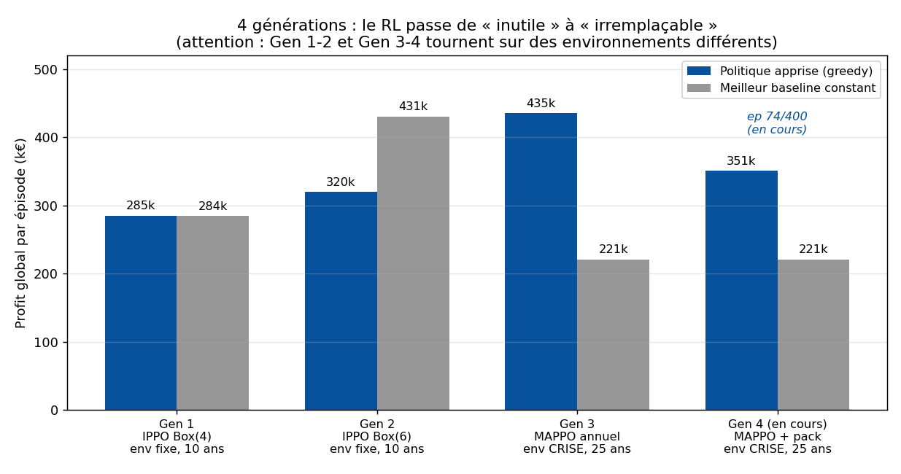
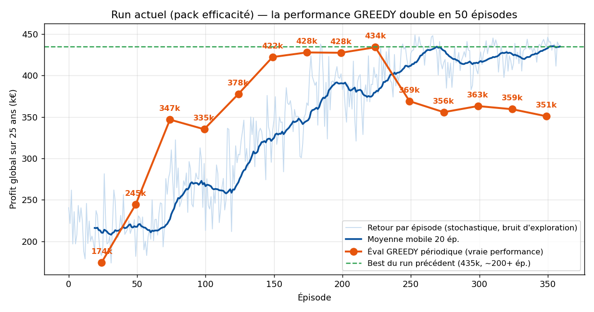
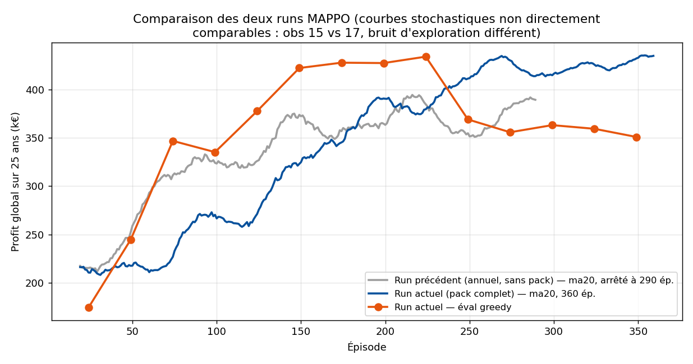

# Rapport d'état — Projet MARL Starfarm

*État complet du projet : architecture, chronologie des expériences, analyse du run en cours.*
*(Données arrêtées à l'épisode 360/400 du run en cours — le run a progressé pendant la rédaction.)*

---

## 1. Résumé exécutif

Le projet a construit, de zéro, une chaîne complète d'**apprentissage par renforcement multi-agent (MARL)** sur la simulation rizicole Starfarm (GAMA), avec l'objectif de **maximiser le profit global des fermiers**. Après quatre générations d'expériences, l'état actuel est :

- ✅ **Pipeline industriel complet** : GAMA ↔ Python optimisé (~70× moins d'allers-retours), entraînement MAPPO, évaluation contre baselines, checkpointing du meilleur modèle, rapports reproductibles.
- ✅ **Le RL apporte une valeur irremplaçable** : dans l'environnement scénario (crise des ressources, 25 ans), la politique apprise atteint **~434k de profit** là où la *meilleure* stratégie fixe plafonne à **220k (+97 %)** et où les pratiques conventionnelles **perdent de l'argent**.
- 🔎 **Découverte du run en cours** : la politique **stochastique** surpasse la politique **déterministe (greedy)** en fin d'entraînement — un effet de la **diversification face au marché couplé** (voir §5).

---

## 2. Architecture technique actuelle

```
Python (train_mappo.py)                         GAMA-server (port 6969)
┌─────────────────────────────┐                 ┌────────────────────────────┐
│ MAPPO                       │   actions Box(6)│ ReinforcementLearning.gaml │
│  · acteur PARTAGÉ (gaussien)│ ──────────────► │  expérience "marl"         │
│  · critique CENTRALISÉ      │                 │  · scénarios météo/marché  │
│    (état global 10×17=170)  │ ◄────────────── │    (PESSIMISTE / CRISE)    │
│  · GAE à gamma variable     │  obs + Δprofit  │  · pont PetzAgent          │
└─────────────────────────────┘   par sous-pas  │  · pratiques (collègue)    │
                                                └────────────────────────────┘
```

| Composant | Valeur actuelle |
|---|---|
| **Algorithme** | MAPPO (CTDE) : acteurs décentralisés à poids partagés + critique centralisé |
| **Action** (par fermier, annuelle) | `Box(6)` continu : irrigation CF/AWD + quantité, pesticide BAU/IPM, engrais BAU/durable, cultivar standard/premium, 2/3 saisons |
| **Observation** (par fermier) | `Box(17)` : 4 état ferme + pollution/salinité + 2 descripteurs statiques (nb parcelles, surface) + **2 signaux marché globaux** (part premium, prix) + 6 dernière action + indice d'année |
| **Récompense** | profit global d'équipe, **versée par sous-pas saisonnier** (delta de profit par fenêtre de 122 j) — décisions annuelles (semi-MDP) |
| **Horizon** | 25 années simulées (scénario 2025-2050), γ = 0.97 annuel (prorata par sous-pas) |
| **Environnement** | météo PESSIMISTE + marché CRISE (eau +5 %/an, engrais +4 %/an), générateur stochastique |
| **Stabilisation** | normalisation adaptative de la valeur, décroissance d'entropie (0.01→0.001), KL early-stop (0.03), critique 256, éval greedy périodique pilotant le best-checkpoint |

---

## 3. Chronologie : quatre générations d'expériences



| Gen | Setup | Résultat | Enseignement |
|---|---|---|---|
| **1** | IPPO, `Box(4)` (irrigation/pesticide/engrais), env fixe, 10 ans | politique ≈ meilleur baseline constant (285k ≈ 284k) ; la courbe d'entraînement **décline** | L'optimum était quasi constant (« BAU intensif ») → presque **rien à apprendre** |
| **2** | + cultivar & saisons → `Box(6)` | apprend (+17 %) mais **sous** le plafond (320k < 431k du baseline premium) | Les bons **leviers** rendent le problème apprenable ; le riz **premium** renverse l'optimum ; IPPO plafonne (attribution de crédit) |
| **3** | **MAPPO** + obs marché + env **scénario crise** + 25 ans | **435k vs 220k** pour le meilleur constant (**+97 %**) ; les stratégies conventionnelles **perdent** (−154k à −305k) | Le critique centralisé + l'adaptativité font du RL un outil **irremplaçable** en environnement difficile |
| **4** *(en cours)* | + pack efficacité : récompense saisonnière, obs 17, value-norm, entropy decay, KL-stop, critique 256, éval greedy | pic greedy **434k dès l'ép. 224** ; divergence stochastique/greedy ensuite (§5) | Convergence plus **rapide et mesurable** ; découverte de l'effet « diversification » |

*Note de lecture : Gen 1-2 (env fixe, 10 ans) et Gen 3-4 (env crise, 25 ans) ne sont **pas comparables** entre elles en valeur absolue.*

---

## 4. Le run en cours (épisode 360/400)



**Phase 1 — montée rapide et quasi monotone (ép. 0 → 224).** L'éval greedy (la *vraie* performance, sans bruit d'exploration) progresse de **174k → 434k** : +149 % en 224 épisodes, avec une trajectoire 174 → 245 → 347 → 378 → 422 → 428 → **434k**. Le pic **égale le meilleur résultat du run précédent (435k)** mais il est atteint de façon *documentée et reproductible* (le run précédent n'avait pas d'éval périodique — on ne savait pas quand il était bon).

**Phase 2 — divergence (ép. 224 → 360).** Les évals greedy **redescendent** (369k, 356k, 363k, 359k, 351k) **pendant que** la courbe stochastique continue de monter (ma20 ≈ **435k**, max 449k). L'écart stochastique − greedy atteint ~80k. Analyse au §5.

**Le filet de sécurité a fonctionné** : le best-checkpoint est piloté par l'éval greedy → le modèle sauvegardé est celui du **pic (434k, ép. 224)**, pas la version dégradée actuelle. C'est exactement le scénario pour lequel ce mécanisme a été ajouté.



Comparaison avec le run précédent (mode annuel, sans pack) : les courbes stochastiques ne sont pas directement comparables (observations 15 vs 17, bruit d'exploration différent), mais le run actuel fournit ce que l'ancien ne pouvait pas : une **mesure fiable de la vraie performance en continu** — et un pic certifié à 434k.

---

## 5. Le phénomène clé : stochastique > greedy

En fin de run, la politique **échantillonnée** (~435k en moyenne) bat nettement sa version **déterministe** (~355k). Ce n'est pas un artefact — c'est une propriété du problème :

1. **Le marché punit l'uniformité.** Le prix du riz premium s'effondre quand l'offre sature : la stratégie optimale n'est pas « tous en premium » mais un **portefeuille diversifié** (une partie des fermiers en premium, l'autre en standard).
2. **L'acteur partagé déterministe ne peut pas se différencier.** Les 10 fermiers partagent les mêmes poids ; à observations proches, le mode greedy produit des décisions **identiques** → comportement uniforme → saturation → profit dégradé.
3. **Le bruit d'échantillonnage brise la symétrie.** En mode stochastique, des tirages différents envoient naturellement une partie des fermiers de chaque côté des seuils (premium/standard…) → diversification → meilleurs prix. PPO optimise précisément le retour de la politique *stochastique* — c'est ce qu'il a appris à exploiter.

**Conséquences pratiques :**
- Pour *déployer* la politique, le mode **stochastique** est légitime (c'est l'objectif optimisé) — ou utiliser le **best-checkpoint greedy** (434k) si l'on exige du déterminisme.
- Pour permettre une diversification *déterministe*, il faudrait que les fermiers puissent se distinguer davantage : identifiant d'agent dans l'observation, ou poids non partagés — piste de la prochaine itération.

---

## 6. Infrastructure et optimisations (acquis du projet)

- **Pont embarqué** : PetzAgent vit dans le monde Starfarm (l'approche co-modèle initiale gelait l'horloge → récompense nulle ; diagnostiqué et corrigé).
- **Batching `nb_step`** : saut groupé calibré par la mémoire des longueurs d'année + finition fine → **~70× moins d'allers-retours** GAMA↔Python (paramètre natif de `gama_client`, bibliothèque intacte).
- **Récompense saisonnière** : delta de profit par fenêtre de 122 j à coût de simulation nul ; le critique apprend sur une chaîne ~4× plus dense (GAE à gamma variable).
- **Injection d'actions** par action-call (l'endpoint `expression` refuse les affectations) ; mode récompense global/par-fermier togglable.
- **Outillage** : éval contre baselines (`eval_policy.py`), logs année par année, configs par expérience, rapports PDF reproductibles.

## 7. État du dépôt et livrables

- **Branche `stage-marl`** : commit `b0cb7f0` (étape Box(6)/IPPO) au-dessus du dernier commit du collègue (`ace90fe`, scénarios) — rebase propre, **rien n'est pushé**.
- **Non committé** (working tree) : toute la génération 3-4 — MAPPO, obs 17, récompense saisonnière, pack efficacité. *À committer une fois le run terminé et évalué.*
- **Livrables** : `rapport_marl_starfarm.pdf` (Gen 1), `rapport_marl_box6.pdf` (Gen 2), présentation vulgarisée (`presentation3.pptx`), et ce rapport d'état.

## 8. Prochaines étapes proposées

1. **Fin du run (ép. 400)** : éval finale du best-checkpoint vs baselines (`eval_policy.py config_mappo2.yaml --best`), + éval **stochastique** pour quantifier proprement l'écart greedy/échantillonné.
2. **Committer la génération MAPPO** sur `stage-marl`.
3. **Briser la symétrie proprement** : identifiant d'agent (one-hot) dans l'observation pour permettre la diversification déterministe — réponse structurelle au phénomène du §5.
4. **Récompense durabilité** (émissions, eau, sol) : transformer « max profit » en arbitrage rendement/durabilité — en attente des besoins du collègue.
5. *(Option)* Parallélisme multi-serveurs GAMA (N threads × N ports) si de nombreux runs sont prévus.
