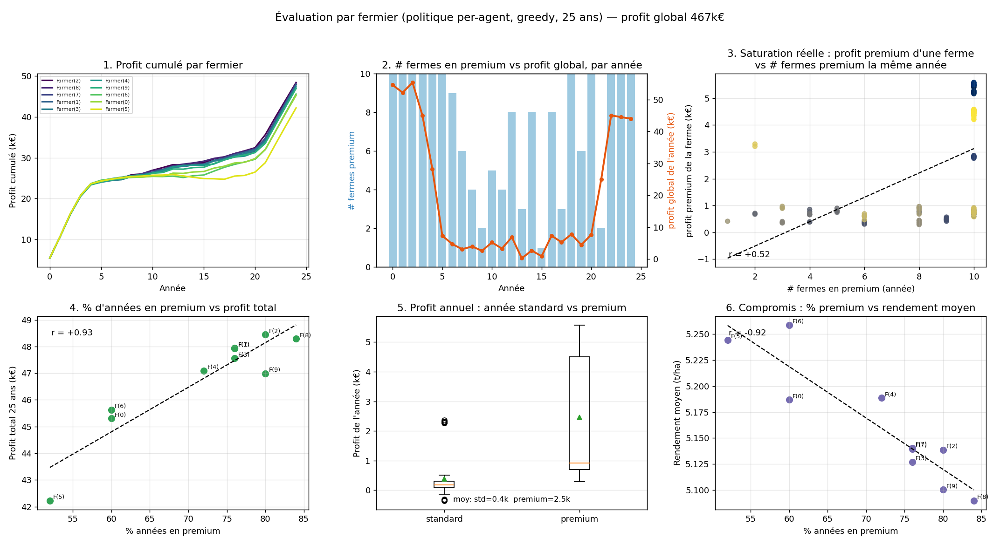

# Évaluation par fermier — politique per-agent (note rapide)

*Projet Starfarm — MARL · 16 juin 2026*

## Contexte

Un épisode d'évaluation **greedy** (déterministe) de la politique **MAPPO en récompense
par fermier** (chaque ferme optimise son propre profit), sur **25 ans**, **10 fermes**,
dans le scénario de crise. Profit global de l'épisode : **467 k€** (≈ le meilleur greedy
~470 k du run). Sorties : le classeur `eval_per_farmer_peragent.xlsx` + la figure ci-dessous.

**Contrôle de cohérence** : la somme des profits par ferme = profit global (`infos`) à
l'euro près → l'attribution par fermier est exacte.

## Contenu du classeur Excel

- **`synthese_fermiers`** : 1 ligne / ferme — profit total et moyen, taille, état moyen, mix d'actions (%).
- **`reward_par_an` / `cultivar_par_an` / `irrigation_par_an`** : matrices année × ferme (profit coloré, premium/AWD surlignés).
- **`actions_completes` / `detail`** : action complète encodée / table brute.
- **`legende`** : dictionnaire de toutes les colonnes.

## Ce qu'on voit

- **Profits resserrés (42–48 k par ferme) et sol sain (0,99) partout** → pas de prédation
  entre fermes ni de sur-exploitation agronomique visible sur 25 ans.
- **Le levier dominant est le cultivar premium** : `% d'années en premium` ↔ `profit total`
  avec **r = +0,93** ; les meilleures fermes font ~80 % de premium, les moins bonnes ~52 %.
- **Compromis premium ↔ rendement** : `% premium` ↔ `rendement` avec **r = −0,92** — le
  premium produit moins de tonnage mais se vend plus cher.
- **Les fermes « suivent le marché » — un cycle d'engouement (panneau 2).** La participation
  au premium n'est pas stable : **plein premium au départ** (les ~6 premières années, 10/10
  fermes), puis **les résultats chutent et la participation s'effondre** (jusqu'à 1–2 fermes
  seulement), avant un **retour au plein premium** en fin d'horizon. C'est un schéma
  **boom–bust / mimétique** : la ruée collective vers le premium érode les gains, les fermes
  se replient, le marché récupère, puis elles repartent.
- **Pratiques durables quasi inutilisées** (`durable` 0 %, `IPM` ~0–4 %, `AWD` ~0–12 %) :
  l'optimum appris est *conventionnel intensif + premium*. Logique, car la **récompense =
  profit pur**, sans pénalité sur la pollution ou l'eau → aucune incitation à la durabilité
  tant qu'elle ne rapporte pas.

