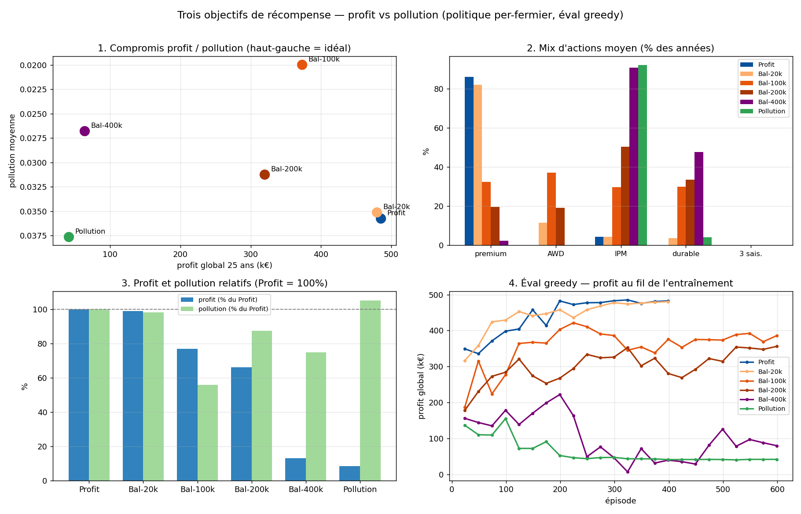

# Balayage λ — frontière profit ↔ pollution (6 politiques)

*Projet Starfarm — MARL · 2 juillet 2026*

## Contexte

Suite du rapport « objectifs » : le point Balanced à λ=20000 se comportait comme Profit
(λ sous le seuil de bascule estimé ~58 000). Trois entraînements supplémentaires ont été
lancés à **λ = 100k / 200k / 400k** (600 épisodes chacun, même pipeline). Les **6
politiques** sont rejouées en greedy (25 ans, mêmes fermes, même ordre de décision) et
mesurées sur les deux axes. Détails par fermier/année dans `eval_objectives_comparison.xlsx`.

**Choix de checkpoint** : la sélection `best_` étant pilotée par le *profit* greedy, elle
n'a de sens que pour la politique Profit ; les politiques pollution/balanced sont évaluées
sur leur **checkpoint final** (convergé sous leur propre objectif, non biaisé profit).

## Résultats

| Politique | Profit global | Pollution moy. | Premium | AWD | IPM | Durable |
|---|---:|---:|---:|---:|---:|---:|
| **Profit** | **484,7 k€** | 0,0357 | 86 % | 0 % | 4 % | 0 % |
| Bal-20k | 479,5 k€ (99 %) | 0,0351 (−2 %) | 82 % | 12 % | 4 % | 4 % |
| **Bal-100k** | **372,8 k€ (77 %)** | **0,0200 (−44 %)** | 32 % | **37 %** | 30 % | **30 %** |
| Bal-200k | 319,9 k€ (66 %) | 0,0312 (−13 %) | 20 % | 19 % | 50 % | 34 % |
| Bal-400k | 63,4 k€ (13 %) | 0,0268 (−25 %) | 2 % | 0 % | 91 % | 48 % |
| Pollution | 40,7 k€ (8 %) | 0,0376 (**+5 %**) | 0 % | 0 % | 92 % | 4 % |

## Trois enseignements majeurs

**1. Bal-100k est le point d'équilibre remarquable — il domine au sens de Pareto.**
Pour **−23 % de profit**, il obtient **−44 % de pollution** (0,0357 → 0,0200). Il fait
*mieux que toutes les politiques plus « vertes »* sur les DEUX axes à la fois : plus de
profit ET moins de pollution que Bal-200k, Bal-400k et Pollution. Sa recette est un **mix**
: ~1/3 premium, ~1/3 AWD, ~1/3 IPM, ~1/3 durable — c'est la *combinaison* AWD + durable +
IPM qui réduit la pollution, pas une pratique isolée.

**2. La politique « pollution pure » échoue sur son propre objectif.** Elle s'enferme dans
un optimum local dégénéré : 92 % d'IPM, rien d'autre (pas d'AWD, 4 % durable) — et sa
pollution (0,0376) est *pire que celle de la politique Profit*. Sans le signal de profit,
l'exploration s'effondre (production quasi nulle → gradient très plat) et elle ne découvre
jamais les leviers efficaces. **Le terme de profit dans la récompense équilibrée agit comme
un guide d'exploration** (reward shaping) : c'est Bal-100k, pas Pollution, qui trouve
comment dépolluer.

**3. Correction du rapport précédent.** La conclusion « pollution largement inélastique,
plancher ~0,0285 » — fondée sur la politique pollution seule — était **fausse** : Bal-100k
atteint **0,0200**. La pollution est bien pilotable (−44 %), mais par une *combinaison* de
pratiques qu'une récompense mono-objectif mal guidée ne trouve pas.

## Lecture de la frontière

- La frontière utile est **fortement non linéaire** : de λ=20k à 100k on achète −42 points
  de pollution pour −22 points de profit ; au-delà de 100k on *perd* sur les deux axes
  (les politiques 200k/400k sont dominées — probablement des optima locaux d'entraînement,
  la non-monotonicité le suggère).
- **Recommandation opérationnelle : λ ≈ 100k** est le réglage à retenir pour un scénario
  « agriculture raisonnée ». Affiner éventuellement par un balayage local (60k–140k).

## Réserves

- **Un épisode greedy par politique** : la variance inter-épisodes du profit est faible
  (CV ~0,4 % mesuré), celle de la pollution n'a pas été quantifiée — les écarts fins
  (ex. 0,0268 vs 0,0312) sont à confirmer par quelques épisodes de plus.
- La non-monotonicité en λ (200k/400k pires que 100k sur la pollution) indique des **optima
  locaux** : relancer ces λ avec d'autres graines départagerait « vrai compromis » et
  « échec d'entraînement ».
- Question modèle pour le collègue : quels mécanismes de `pollution_level` rendent le
  combo **AWD + durable** si efficace, là où l'IPM seul ne suffit pas ?
