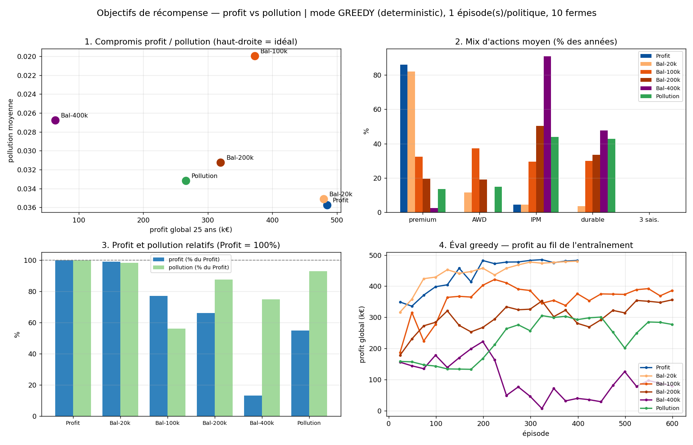
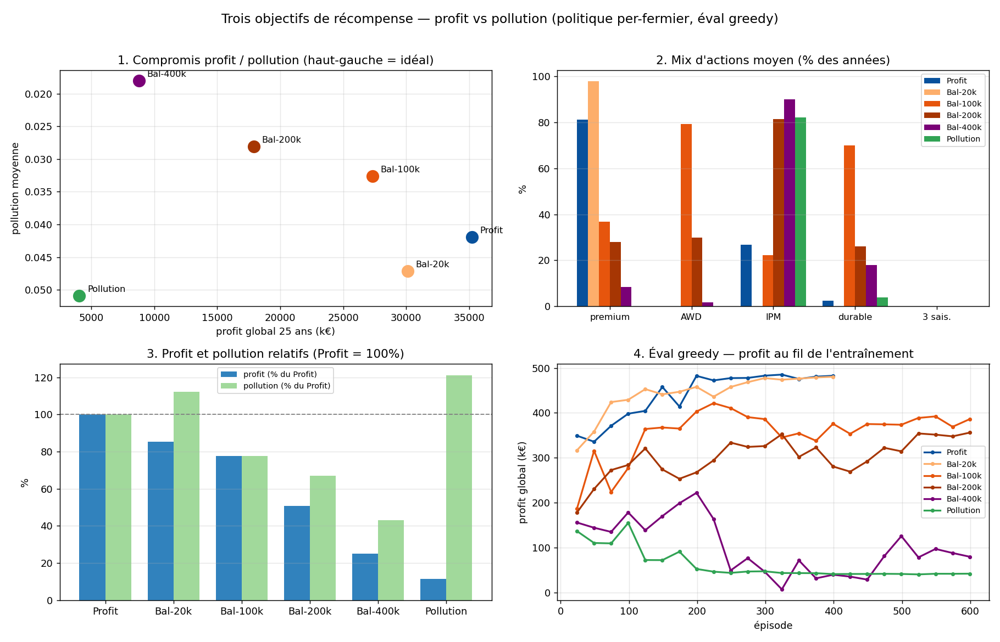
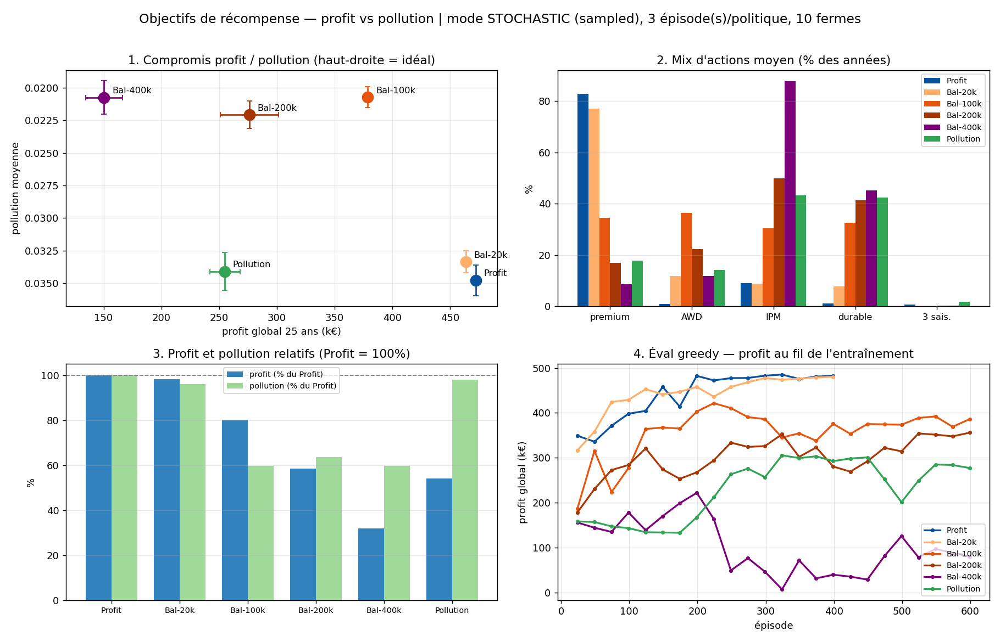
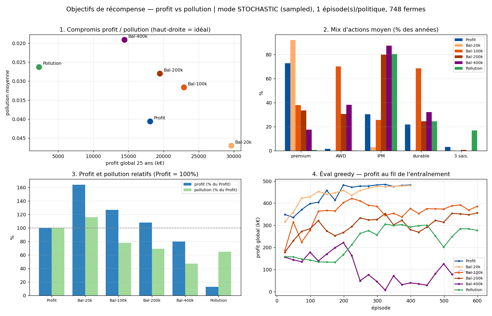
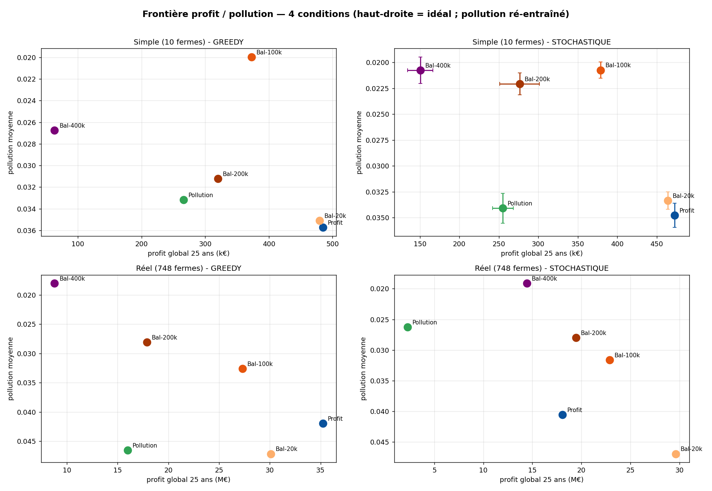

# Balayage λ — frontière profit ↔ pollution (6 politiques)

*Projet Starfarm — MARL · 8 juillet 2026*

## Contexte

Suite du rapport « objectifs » : le point Balanced à λ=20000 se comportait comme Profit
(λ sous le seuil de bascule estimé ~58 000). Trois entraînements supplémentaires ont été
lancés à **λ = 100k / 200k / 400k** (600 épisodes chacun, même pipeline). Les **6
politiques** sont rejouées en greedy (25 ans, mêmes fermes, même ordre de décision) et
mesurées sur les deux axes. Le modèle **pollution a été ré-entraîné** (lr 1e-4) ; ses
valeurs à jour figurent partout. Détails dans `eval_objectives_comparison_*.xlsx`.

**Choix de checkpoint** : la sélection `best_` étant pilotée par le *profit* greedy, elle
n'a de sens que pour la politique Profit ; les politiques pollution/balanced sont évaluées
sur leur **checkpoint final** (convergé sous leur propre objectif, non biaisé profit).

## Résultats (greedy, 10 fermes)

| Politique | Profit global | Pollution moy. | Premium | AWD | IPM | Durable |
|---|---:|---:|---:|---:|---:|---:|
| **Profit** | **484,7 k€** | 0,0357 | 86 % | 0 % | 4 % | 0 % |
| Bal-20k | 479,5 k€ (99 %) | 0,0351 (−2 %) | 82 % | 12 % | 4 % | 4 % |
| **Bal-100k** | **372,8 k€ (77 %)** | **0,0200 (−44 %)** | 32 % | **37 %** | 30 % | **30 %** |
| Bal-200k | 319,9 k€ (66 %) | 0,0312 (−13 %) | 20 % | 19 % | 50 % | 34 % |
| Bal-400k | 63,4 k€ (13 %) | 0,0268 (−25 %) | 2 % | 0 % | 91 % | 48 % |
| Pollution | 265,9 k€ (55 %) | 0,0332 (−7 %) | 14 % | 15 % | 44 % | 43 % |

## Trois enseignements majeurs

**1. Bal-100k est le point d'équilibre remarquable — il domine au sens de Pareto.**
Pour **−23 % de profit**, il obtient **−44 % de pollution** (0,0357 → 0,0200). Il fait
*mieux que toutes les politiques plus « vertes »* sur les DEUX axes à la fois : plus de
profit ET moins de pollution que Bal-200k, Bal-400k et Pollution. Sa recette est un **mix**
: ~1/3 premium, ~1/3 AWD, ~1/3 IPM, ~1/3 durable.

**2. La politique « pollution pure », même ré-entraînée, reste dominée.** Le ré-entraînement
(lr 1e-4) a corrigé l'optimum dégénéré « IPM-seul » du run précédent : à 10 fermes elle
adopte enfin un mix (IPM 44 %, durable 43 %, AWD 15 %) et sa pollution (0,0332) passe sous
celle de Profit. Mais elle **ne bat toujours pas Bal-100k** (0,0200) sur son propre objectif.
Sans le signal de profit comme **guide d'exploration** (reward shaping), elle converge vers
un régime médiocre plutôt que vers les vrais leviers : c'est Bal-100k, pas Pollution, qui
dépollue le mieux.

**3. Correction du rapport précédent.** La conclusion « pollution largement inélastique,
plancher ~0,0285 » — fondée sur la politique pollution seule — était **fausse** : Bal-100k
atteint **0,0200**. La pollution est bien pilotable (−44 %), mais par une *combinaison* de
pratiques qu'une récompense mono-objectif mal guidée ne trouve pas.

## Lecture de la frontière

- La frontière utile est **fortement non linéaire** : de λ=20k à 100k on achète −42 points
  de pollution pour −22 points de profit ; au-delà de 100k on *perd* sur les deux axes
  (les politiques 200k/400k sont dominées — probablement des optima locaux d'entraînement,
  la non-monotonicité le suggère).
- **Recommandation opérationnelle : λ ≈ 100k** est le réglage à retenir pour un scénario
  « agriculture raisonnée ». Affiner éventuellement par un balayage local (60k–140k).

## Validation à grande échelle — simulation réelle (748 fermes), greedy

Les 6 politiques (entraînées sur 10 fermes) ont été rejouées **sans réentraînement** sur le
modèle spatial réel (`simple_spatial_data=false`, **748 fermes**). Détails dans
`eval_objectives_comparison_bigmodel.xlsx`.

*Note : sur cette figure le point Pollution correspond à l'ancien run ; la valeur du tableau
ci-dessous est le modèle ré-entraîné.*

| Politique | Profit global | (% Profit) | Pollution moy. | (vs Profit) |
|---|---:|---:|---:|---:|
| **Profit** | **35,22 M€** | 100 % | 0,0420 | réf. |
| Bal-20k | 30,11 M€ | 85 % | 0,0471 | **+12 %** (dominée) |
| **Bal-100k** | 27,30 M€ | **77 %** | 0,0326 | **−22 %** |
| **Bal-200k** | 17,89 M€ | 51 % | 0,0281 | **−33 %** |
| **Bal-400k** | 8,79 M€ | 25 % | **0,0181** | **−57 %** |
| Pollution | 15,98 M€ | 45 % | 0,0465 | +11 % (dominée) |

Ce que la grande échelle change et confirme :

- **La frontière devient propre et monotone** : à 748 fermes, Bal-100k → 200k → 400k
  échangent régulièrement du profit contre de la pollution (−22 % / −33 % / −57 %). Le
  curseur λ fonctionne comme prévu — la dominance totale de Bal-100k observée à 10 fermes
  ne se reproduit pas : elle tenait à l'environnement d'évaluation réduit, pas aux
  politiques elles-mêmes.
- **Deux résultats robustes aux deux échelles** : (1) la politique **Pollution reste dominée**
  (0,0465, au-dessus de Profit) — le ré-entraînement l'a sortie de la dégénérescence mais pas
  rendue compétitive ; (2) **Bal-100k conserve ~77 % du profit** aux deux échelles.
- **Bal-20k est dominée à grande échelle** (moins de profit ET plus de pollution que
  Profit) : λ trop faible ne fait que dégrader, il n'équilibre rien.
- Les mix d'actions s'adaptent à la carte réelle (Bal-100k : AWD 79 %, durable 70 % —
  bien plus qu'à 10 fermes) : la politique étant conditionnée à l'état, elle module ses
  pratiques selon les fermes réelles.

**Recommandation finale (greedy)** : λ≈100k pour un scénario « raisonné » (77 % du profit,
−22 % de pollution), λ≈400k pour un scénario « priorité environnement » (−57 % de pollution
en gardant 25 % du profit).

## Décisions stochastiques — simulation simple (10 fermes)

Mêmes politiques, mais l'action est **échantillonnée** dans la distribution de la politique
(au lieu de la moyenne greedy). 3 épisodes, moyenne ± écart-type.

| Politique | Profit global | Pollution moy. | Premium | AWD | IPM | Durable |
|---|---:|---:|---:|---:|---:|---:|
| Profit | 472,4 k€ (±1,7) | 0,0348 (±0,0012) | 83 % | 1 % | 9 % | 1 % |
| Bal-20k | 463,8 k€ (±3,8) | 0,0333 (±0,0008) | 77 % | 12 % | 9 % | 8 % |
| **Bal-100k** | 378,9 k€ (±3,7) | **0,0207 (±0,0008)** | 35 % | 37 % | 30 % | 33 % |
| Bal-200k | 276,4 k€ (±25,2) | 0,0221 (±0,0011) | 17 % | 22 % | 50 % | 41 % |
| **Bal-400k** | 150,5 k€ (±16,0) | 0,0207 (±0,0013) | 9 % | 12 % | 88 % | 45 % |
| Pollution | 255,1 k€ (±13,2) | 0,0341 (±0,0014) | 18 % | 14 % | 43 % | 43 % |

- **Pour les politiques rentables, greedy ≈ stochastique** (Profit 485 → 472 k, −2,5 % ;
  Bal-100k quasi identique) avec une variance faible : les conclusions greedy sont robustes.
- **Exception : Bal-400k et Bal-200k s'améliorent en stochastique** — Bal-400k passe de 63 k
  (greedy) à **150 k** (+137 %) *et* devient plus verte (0,0268 → 0,0207). L'échantillonnage
  sort ces politiques très contraintes d'un mode déterministe médiocre (diversification de
  type jeu de minorité). Contrepartie : leur variance est bien plus élevée (Bal-200k ±25 k).

## Décisions stochastiques — simulation réelle (748 fermes)

| Politique | Profit global | Pollution moy. | Premium | AWD | IPM | Durable |
|---|---:|---:|---:|---:|---:|---:|
| Profit | 18,07 M€ | 0,0406 | 73 % | 2 % | 30 % | 22 % |
| Bal-20k | 29,63 M€ | 0,0469 | 92 % | 0 % | 3 % | 1 % |
| Bal-100k | 22,89 M€ | 0,0316 | 38 % | 70 % | 26 % | 69 % |
| Bal-200k | 19,45 M€ | 0,0280 | 34 % | 31 % | 80 % | 25 % |
| **Bal-400k** | 14,43 M€ | **0,0191** | 18 % | 38 % | 88 % | 32 % |
| Pollution | 2,27 M€ | 0,0263 | 1 % | 0 % | 80 % | 25 % |

- **Ici greedy et stochastique divergent fortement** (contrairement à 10 fermes). Profit
  chute de **35,2 M (greedy) à 18,1 M (stoch, −49 %)** : le bruit d'échantillonnage casse la
  coordination premium collective de la politique la plus rentable.
- À l'inverse, les politiques contraintes **gagnent** au sampling : Bal-400k 8,8 → **14,4 M
  (+64 %)**, Bal-200k 17,9 → 19,4 M. Même mécanisme qu'à 10 fermes, mais amplifié par
  l'échelle (voisinage plus dense, coordination plus fragile).
- **Conséquence pratique** : en déploiement on joue le **greedy** (déterministe) ; les
  chiffres greedy réels sont la performance attendue. Le stochastique reste un diagnostic
  de la largeur de la distribution de la politique.

## Synthèse — quatre conditions

La figure superpose les frontières greedy/stochastique aux deux échelles (haut-droite =
idéal, pollution ré-entraîné partout). Message d'ensemble : **le curseur λ pilote un vrai
compromis profit/pollution robuste** (Bal-100k raisonné, Bal-400k vert), l'objectif
pollution-seul est à éviter, et l'écart greedy/stochastique — négligeable à 10 fermes —
devient un facteur de premier ordre à 748 fermes.

## Réserves

- **Un seul épisode** en *réel* (les deux échelles/modes sauf simple stochastique, à 3
  épisodes) : les points *réels* sont indicatifs, leur variance n'est pas quantifiée.
- Le *réel greedy* des 5 politiques inchangées provient du run précédent (mêmes modèles),
  fusionné avec le point pollution ré-entraîné mesuré séparément.
- L'écart greedy/stochastique est en partie gouverné par `log_std` (indépendant de l'état) :
  une politique à `log_std` élevé diverge davantage sous échantillonnage.
- Limite modèle (à remonter) : la pollution n'est ajoutée que par les pesticides ; ni
  l'irrigation (AWD, méthane) ni la fertilisation (ruissellement azote) n'y contribuent —
  l'adoption d'AWD/durable par les politiques vertes agit donc surtout *via* la maîtrise de
  la pression ravageur, pas directement.
