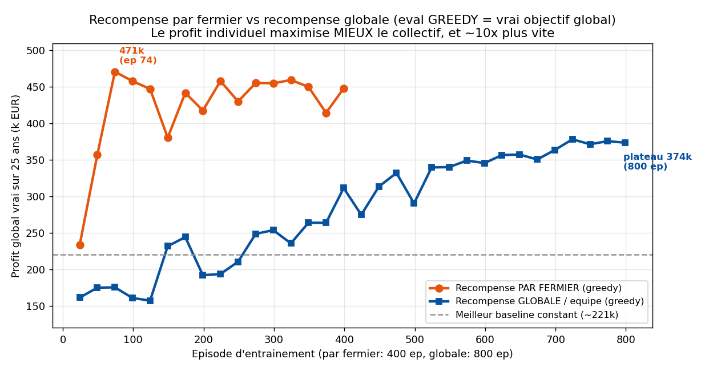
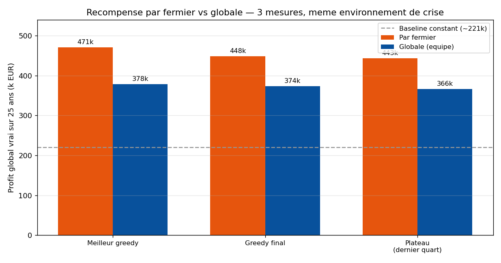
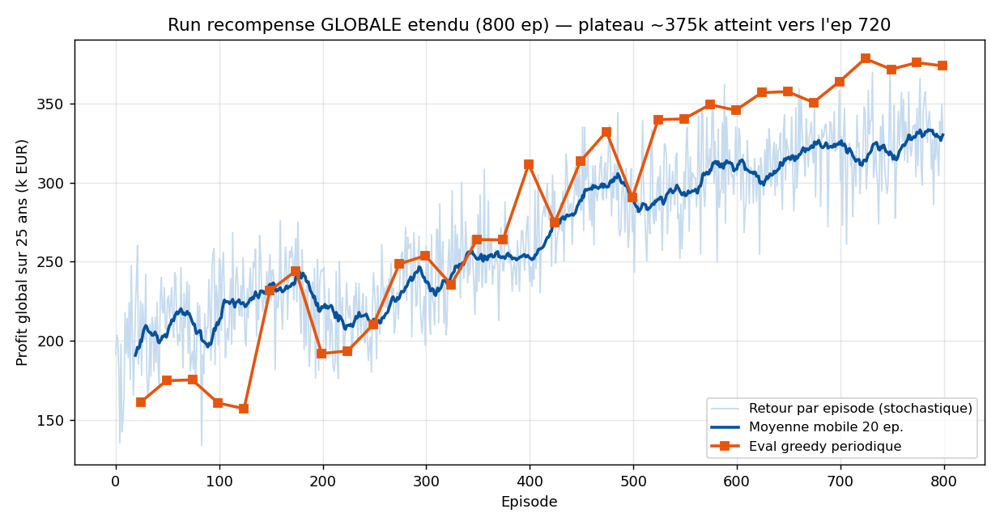

# Récompense par fermier vs récompense globale — comparaison MAPPO

**Projet Starfarm — apprentissage par renforcement multi-agents**
*Rapport de comparaison · 16 juin 2026 (màj : run global prolongé à 800 épisodes)*

---

## 1. Question posée

Pour maximiser le **profit global** (somme des profits annuels de tous les fermiers) dans
un environnement de marché couplé, vaut-il mieux entraîner chaque fermier avec :

- une **récompense globale** (« équipe ») — tout le monde reçoit le même signal
  `r = somme des profits de tous les fermiers` ; ou
- une **récompense par fermier** — chaque fermier reçoit *son propre* profit comme signal,
  le critique restant centralisé (il prédit le retour moyen par fermier, donc l'avantage de
  chaque fermier = son retour propre relativement à cette base commune) ?

Intuition classique : la récompense globale aligne directement les agents sur l'objectif et
devrait gagner. **Le résultat est l'inverse.**

## 2. Protocole — strictement comparable

Les deux entraînements partagent **tout** sauf le mode de récompense :

| Paramètre | Valeur (identique aux deux runs) |
|---|---|
| Algorithme | MAPPO (acteur partagé décentralisé + critique centralisé) |
| Environnement | Scénario de crise (météo pessimiste, marché en crise), 2025–2050 |
| Horizon | 25 ans / épisode · récompense par saison, décisions annuelles |
| Décisions | Séquentielles, ordre aléatoire (signal de marché dynamique) |
| Espace d'action | `Box(6)` (irrigation + quantité, pesticide, fertilisant, cultivar, saisons) |
| Observation | 18 variables (ferme locale + signaux de marché globaux) |
| Budget | Par fermier : **400 ép.** · Globale : **800 ép.** (prolongée pour borner l'asymptote) · pack efficacité (normalisation des valeurs, décroissance d'entropie, arrêt KL, critique élargi, éval greedy périodique) |

**Métrique de comparaison.** L'évaluation périodique mesure le **vrai profit global**
(`infos["global_profit"]`, jouée en mode *greedy* sans bruit d'exploration) — la **même
quantité** dans les deux runs, quel que soit le signal d'entraînement. La comparaison est
donc parfaitement « pommes contre pommes ».

> Note de fiabilité : le run *global* (`saved_models_mappo3`) est une course propre de 400
> épisodes. Le run *par fermier* (`saved_models_mappo3_peragent`) a subi un incident de
> reprise de checkpoint au milieu (corrigé) ; le pic d'origine à l'épisode 74 a bien été
> obtenu *from-scratch* avant l'incident, et la reprise a maintenu le même plateau. Les
> conclusions ne dépendent pas de l'incident.

## 3. Résultat

| Mesure (profit global vrai, 25 ans) | Par fermier (400 ép.) | Globale (800 ép.) | Écart |
|---|---:|---:|---:|
| **Meilleur greedy** | **470,8 k** (ép 74) | 378,2 k (ép 724) | **+24 %** |
| Greedy final | 448,0 k | 373,6 k (ép 799) | +20 % |
| Plateau (dernier quart) | 443,0 k | 365,9 k | +21 % |
| Baseline constant (réf., même env) | ~220 k | ~220 k | — |

Trois lectures, une même conclusion : **la récompense par fermier domine la récompense
globale sur l'objectif global lui-même**, d'environ **+20 à +25 %** sur les trois mesures.
Le run global prolongé à 800 épisodes a refermé une partie de l'écart (il était de +51 %
au snapshot de 400 ép.) mais **plafonne ~20 % en dessous** du plateau par-fermier.

**Efficacité d'échantillonnage — l'avantage décisif.** La récompense par fermier atteint
son plateau (~470 k) dès l'**épisode 74** ; la récompense globale, prolongée à **800
épisodes**, ne plafonne qu'à **~375 k** et seulement vers l'**épisode 720**. Autrement dit,
le signal par-fermier atteint un résultat **plus haut** en **~10× moins d'épisodes**.

## 4. Pourquoi le profit individuel maximise mieux le profit collectif

Deux mécanismes se cumulent, propres à ce problème :

1. **Attribution du mérite (credit assignment).** Avec la récompense globale, chaque
   fermier doit apprendre à travers le bruit des 9 autres : si le profit collectif monte,
   est-ce grâce à *mon* action ou à celle d'un voisin ? Le gradient de chaque agent est
   pollué par les décisions des autres → apprentissage lent et bruité. La récompense par
   fermier donne à chacun un signal **propre, à faible variance** (son profit) → gradient
   net → apprentissage rapide et stable.

2. **Le marché récompense la diversité (jeu de minorité / El Farol).** Le prix premium
   chute si trop de fermiers produisent du riz premium. L'optimum collectif est donc
   **hétérogène** (un sous-ensemble en premium, le reste en standard). Des agents
   intéressés à leur seul profit se **différencient naturellement** : dès que le premium
   est saturé, le fermier suivant a intérêt à rester standard. Une politique partagée
   entraînée sur un signal commun tend au contraire vers un comportement **uniforme**, que
   le marché pénalise. Les décisions séquentielles en ordre aléatoire (signal de marché
   dynamique) fournissent exactement le mécanisme de coordination qui permet à la politique
   par fermier de diversifier.

Autrement dit : ici, « chacun pour soi » sur un marché bien conçu produit un meilleur
résultat collectif que « tous pour le total », parce que le total est non-additif (couplé
par le prix) et récompense l'hétérogénéité.

## 5. Réserves et honnêteté méthodologique

- **Asymptote globale bornée (run prolongé à 800 ép.).** Le run global a été poussé à 800
  épisodes : il converge vers un plateau de **~375 k** atteint vers l'épisode 720 (le creux
  vers l'ép. 424 vient de la ré-augmentation volontaire du pas d'apprentissage à la reprise).
  L'écart avec le par-fermier s'est donc réduit (de +51 % au snapshot de 400 ép. à +24 %)
  mais **ne se referme pas** : la récompense globale plafonne ~20 % plus bas, malgré un
  budget doublé. Les conclusions sur l'**efficacité** (~10×) et sur l'**asymptote**
  (par-fermier supérieur) sont désormais solides, plus seulement extrapolées.
- **Risque théorique de la récompense par fermier : la « tragédie des communs ».** Des
  agents égoïstes pourraient surexploiter une ressource partagée. Ici ce n'est *pas*
  observé (le profit global est plus haut, pas plus bas), parce que le couplage de marché
  passe par le **prix** (négatif pour l'uniformité) et non par une ressource physique
  épuisable partagée. Si une telle ressource était ajoutée au modèle, il faudrait
  re-vérifier.
- **Baseline constant** (~220 k) repris de la mesure Gen 3 dans le même environnement de
  crise (valeur indicative, non ré-évaluée pour ce run précis). Les deux politiques
  apprises battent largement toute stratégie fixe — le RL reste irremplaçable dans cet
  environnement.

## 6. Conclusion et recommandation

| | Par fermier | Globale |
|---|---|---|
| Profit global atteint | **~470 k** (400 ép.) | ~375 k (800 ép.) |
| Vitesse d'apprentissage | plateau ép. 74 | plateau ép. ~720 (~10× plus lent) |
| Signal de gradient | propre, faible variance | bruité (mérite mal attribué) |
| Comportement émergent | diversifié (premium/standard) | tend vers l'uniforme |

**Recommandation : adopter la récompense par fermier** comme configuration de référence
pour la suite (`config_mappo3_peragent.yaml`, checkpoint `best_starfarm_ippo.pth` ≈ 471 k).
Elle maximise mieux l'objectif global *et* apprend bien plus vite, grâce à une meilleure
attribution du mérite et à la diversification spontanée que le marché récompense.

Pistes immédiates : (1) *[fait]* le run global a été borné à 800 ép. (~375 k) ; (2) tester
la robustesse de la politique par fermier sur un nombre de fermiers / une région différents
(la transférabilité étant la raison du choix d'observations sans identifiant d'agent) ;
(3) vérifier qu'aucune sur-exploitation ne se cache derrière le gain par-fermier
(répartition premium/standard, qualité de sol en fin d'horizon).
