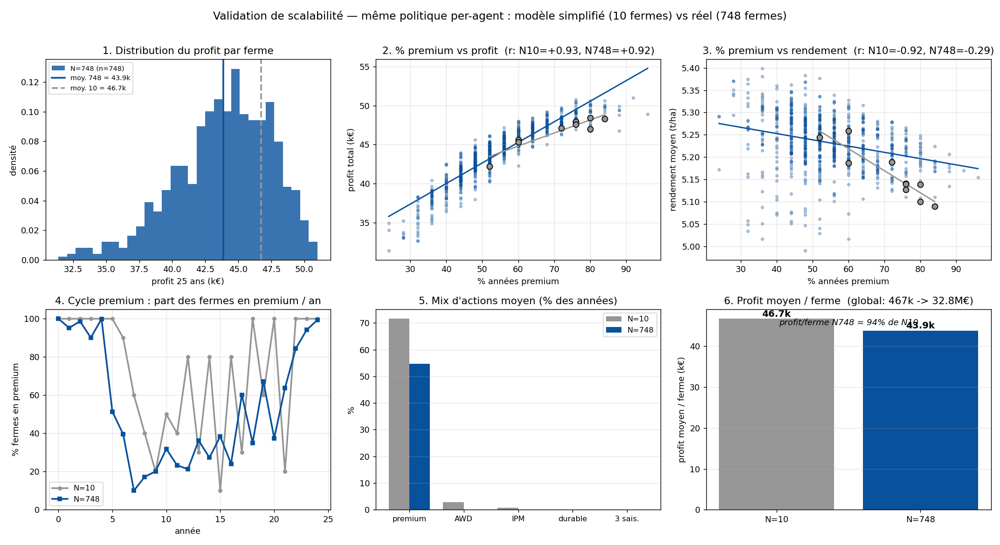

# Validation de scalabilité — politique per-agent (10 → 748 fermes)

*Projet Starfarm — MARL · 23 juin 2026*

## Objectif

Vérifier que la politique entraînée (MAPPO, récompense par fermier) **fonctionne sur le
modèle réel** — beaucoup plus de fermes — alors qu'elle a été entraînée sur le modèle
simplifié (10 fermes). On bascule le paramètre `simple_spatial_data` à `false` et on
**réévalue la même politique, sans aucun réentraînement**.

**Pourquoi ça peut marcher :** l'acteur est **partagé et sans identifiant d'agent** (il ne
voit que l'état physique + les signaux de marché de chaque ferme). Il est donc, par
construction, **indépendant du nombre de fermes**. Seul le critique centralisé dépend de
`n_agents`, et il n'est **pas utilisé en évaluation** (le greedy n'appelle que l'acteur).

## Résultat global

| | Modèle simplifié | Modèle réel |
|---|---:|---:|
| Nombre de fermes | 10 | **748** (×75) |
| Profit global (25 ans) | 467 k€ | **32,80 M€** |
| Profit moyen / ferme | 46,7 k | **43,9 k (94 %)** |
| Exécution | — | **sans erreur, sans réentraînement** |
| Somme par ferme = global | ✅ | ✅ |

## Ce que valident les courbes

1. **Distribution du profit par ferme** — même plage, moyennes proches (46,7 k → 43,9 k).
   À 748 fermes le profit par exploitation reste au même niveau qu'à 10.
2. **% premium ↔ profit** — la relation est **quasi identique** : r = +0,93 (N=10) vs
   **+0,92 (N=748)**. Le levier premium garde exactement le même poids économique à grande échelle.
3. **% premium ↔ rendement** — négatif aux deux échelles (le premium se paie en rendement),
   mais **plus bruité à 748** (r passe de −0,92 à −0,29) : avec les vraies fermes (tailles,
   sols hétérogènes), le rendement dépend de plus de facteurs que du seul choix de cultivar.
   *Direction préservée, corrélation plus lâche.*
4. **Cycle premium (boom-bust)** — même forme aux deux échelles : plein premium au départ →
   effondrement au milieu → remontée en fin d'horizon. La courbe à 748 est simplement plus
   **lisse** (moyennée sur 748 fermes).
5. **Mix d'actions** — **identique** : premium ~70 % des années, et AWD / IPM / durable /
   3 saisons quasi nuls dans les deux cas. La stratégie apprise est la même.
6. **Profit moyen / ferme** — 94 % du niveau du modèle simplifié, pour un profit global qui
   passe de 467 k€ à **32,8 M€**.

## Conclusion

**Scalabilité validée.** La même politique, sans réentraînement, généralise du modèle
simplifié (10 fermes) au modèle réel (748 fermes, ×75) en conservant :

- le **niveau de profit par ferme** (~94 %),
- la **relation premium ↔ profit** (r ≈ +0,92),
- la **dynamique collective** (cycle premium, mix d'actions).

C'est la confirmation directe du choix de design « acteur partagé sans identifiant d'agent » :
la politique est **transférable en nombre de fermes**. Seule réserve mineure : le compromis
rendement est plus bruité à grande échelle (hétérogénéité des fermes réelles), ce qui n'affecte
pas le résultat économique. Une légère baisse de ~6 % du profit/ferme est attendue sans
réentraînement ; un court fine-tuning sur le modèle réel la refermerait probablement.
