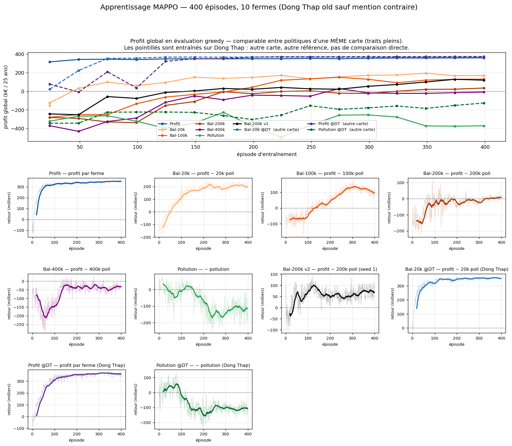

# Mise à jour — effet de la graine, et non-transférabilité entre provinces

Complément à `rapport_transfert.md`, à partir de deux entraînements supplémentaires conçus
comme des **contrôles** : chacun ne fait varier qu'une seule chose par rapport à un run
existant, ce qui permet d'attribuer l'écart à cette variable et à rien d'autre.

| run | ce qui change | tout le reste |
|---|---|---|
| `l200k_v2` | graine 0 → **1** | identique à Bal-200k |
| `dtnew_l20k` | carte d'entraînement → **Dong Thap** | identique à Bal-20k |

---

## 1. La graine change tout — λ=200k, 400 épisodes, même config

| mesure | seed 0 | seed 1 | rapport |
|---|---|---|---|
| éval greedy finale | 34 967 | **119 488** | **×3,4** |
| meilleure éval | 34 967 | **128 655** | **×3,7** |
| retour d'entraînement (10 % derniers ép.) | 6 353 | **72 778** | ×11,5 |

Seule la graine diffère. λ, hyperparamètres, carte, budget d'épisodes : identiques.

**Trajectoire de la graine 1** (éval greedy, tous les 25 épisodes) :

```
ép.   24     49     74     99    124    149    174    199
    -244k  -252k   -57k   -77k   -13k   +3,5k  +30k   +21k

ép.  224    249    274    299    324    349    374    399
     +41k   +27k   +22k   +54k   +73k  +100k  +129k  +119k
```

Deux enseignements, au-delà de l'écart brut :

**Le budget de 400 épisodes tronque l'entraînement.** La graine 1 montait encore au 374ᵉ
épisode (+129k). Elle n'a pas convergé : elle a été arrêtée. La graine 0, elle, n'a jamais
décollé — plafonnée à +35k.

**La convergence est tardive et non monotone.** Le zéro n'est franchi qu'au 149ᵉ épisode,
après quoi la courbe oscille entre +21k et +129k. À comparer avec λ=20k sur la même carte,
qui atteint son plateau dès le 74ᵉ épisode et n'en bouge plus.

### Confirmé en évaluation

L'écart ne se limite pas aux courbes d'entraînement. Les deux graines repassées dans
`eval_conditions.py` (métrique du rapport de transfert : profit par ferme, actions greedy) :

| carte | seed 0 | seed 1 (v2) | baseline sans IA |
|---|---|---|---|
| DT old simplifiée (10) | 3,2 → **−1,5** | **12,9 → +8,2** | +4,7 |
| DT old complète (748) | −6,1 → **−17,3** | **4,9 → −6,2** | +11,1 |

*(k€/ferme sur 25 ans ; après la flèche, l'écart à la baseline de la même carte.)*

×4 sur la carte simplifiée, changement de signe sur la carte complète. La graine 0 est sous la
baseline partout ; la graine 1 la dépasse sur carte simplifiée.

**La conclusion opérationnelle ne bouge pas pour autant** : sur la carte réelle, même la bonne
graine reste **sous la baseline sans IA** (−6,2 k€/ferme). λ=200k ne donne pas de politique
utilisable à l'échelle réelle, quelle que soit la graine. La graine déplace l'ampleur de
l'échec, pas sa nature — et c'est maintenant établi sur deux tirages, non plus un.

### Conséquence directe sur le sweep λ

Le sweep a donné **le même budget de 400 épisodes et une seule graine** à chaque valeur de λ.
Or les λ élevés convergent nettement plus lentement. Les résultats du sweep confondent donc
trois causes qu'on ne peut plus démêler a posteriori :

1. une mauvaise valeur de λ,
2. un budget d'épisodes insuffisant pour ce λ,
3. un tirage de graine défavorable.

**Correction explicite de `rapport_transfert.md`** : ce rapport conclut que « Bal-200k est un
entraînement raté, pas un effet de λ ». C'est faux. Le run d'origine n'a pas échoué — il a été
arrêté trop tôt, avec une graine défavorable. La section interprétant le sweep λ n'est pas
concluante en l'état ; il faudrait 3 à 5 graines par valeur de λ et un critère d'arrêt sur
convergence plutôt qu'un budget fixe pour la rendre exploitable.

Ce point n'affecte **pas** le reste du rapport de transfert, qui repose sur les évaluations
des politiques et non sur le sweep.

---

## 2. Une politique ne transfère pas d'une province à l'autre

### Le contrôle

Bal-20k, appliquée à Dong Thap sans réentraînement, **perd de l'argent et fait moins bien
qu'une stratégie constante**. La même récompense, entraînée directement sur cette carte,
converge très haut :

| Bal-20k | éval greedy finale | convergence |
|---|---|---|
| entraînée sur Dong Thap **old** | 170 622 | tardive |
| entraînée sur **Dong Thap** | **367 429** | dès l'ép. 124, plateau ±0,6 % |

### Confirmé en évaluation, et elle bat la meilleure politique transférée

Repassée dans `eval_conditions.py`, même métrique que le rapport de transfert :

| carte | Bal-20k transférée | **Bal-20k @DT** | Profit transférée | baseline |
|---|---|---|---|---|
| DT simplifiée (10) | −10,2 → −1,7 | **36,6 → +45,2** | 27,5 → +36,1 | −8,6 |
| DT complète (992) | 8,9 → +2,2 | **27,6 → +21,0** | 26,6 → +20,0 | +6,6 |

*(k€/ferme ; après la flèche, l'écart à la baseline de la même carte.)*

La même récompense passe de **sous la baseline** (−1,7) à **+45,2 k€/ferme** par le seul fait
d'avoir été entraînée sur la bonne carte — et dépasse Profit, la meilleure politique
transférée, aux deux échelles.

Son mix d'actions n'est pas celui de la version transférée : 41 % d'AWD et 52 % de premium sur
carte simplifiée, 49 % et 62 % sur carte complète. Elle exploite la carte au lieu de rejouer
un réglage appris ailleurs.

**Contrepartie : elle est moins robuste à l'échelle.** Elle ne conserve que **75 %** de son
profit par ferme de 10 à 992 fermes (36,6 → 27,6), contre 97 % pour Profit sur les deux
provinces. Son avance sur Profit fond donc presque entièrement à pleine échelle : +21,0 contre
+20,0, soit 1 k€/ferme — un écart que ce protocole (un seul épisode sur carte complète) ne
distingue pas du bruit. L'écart sur carte simplifiée (+45,2 contre +36,1, sur 3 épisodes) est
lui bien réel.

Côté pollution, elle se situe entre les deux : 0,0056 puis 0,0071, contre 0,0034 / 0,0058 pour
la transférée et 0,0066 / 0,0095 pour Profit. Elle a gagné en profit sans que λ=20k lui fasse
minimiser la pollution — cohérent avec l'axe pollution qui ne répond pas au levier IPM.

### Ce n'est pas une carte plus difficile

L'objection évidente serait que Dong Thap est simplement plus dure. Les données disent
l'inverse : le retour d'entraînement y démarre à **+204 567**, contre **−80 053** sur la carte
d'origine. La nouvelle province est **plus favorable**, et pourtant la politique transférée y
échoue. L'échec est donc bien imputable au transfert.

### Sur les quatre cartes

Écart à la meilleure baseline sans IA de la **même** carte (k€/ferme ; `> 0` = bat une
stratégie qui ignore l'état) :

| politique | old simple | old complet | new simple | new complet |
|---|---|---|---|---|
| **Profit** | +41,4 | +33,9 | +36,1 | +20,0 |
| Bal-100k | +18,9 | +2,4 | +14,5 | +1,3 |
| Bal-20k | +26,9 | +16,4 | **−1,7** | +2,2 |
| Bal-400k | +8,8 | **−7,0** | **−11,1** | **−4,6** |
| Bal-200k | **−1,5** | **−17,3** | +3,6 | **−13,3** |
| Pollution | **−10,2** | **−35,3** | **−22,0** | **−35,0** |

**Cinq politiques sur six** perdent leur avantage en changeant de province, trois passent
sous la baseline. Seule Profit reste solidement positive partout — en perdant tout de même
~40 % de son profit par ferme (46,2 → 27,5 k€).

### Nuance importante : l'échelle transfère, la province non

Ces deux axes se comportent de façon opposée, et les confondre serait une erreur :

| Profit | 10 fermes | carte complète | conservé |
|---|---|---|---|
| Dong Thap old | 46,2 k€ | 45,0 k€ (748) | **97 %** |
| Dong Thap | 27,5 k€ | 26,6 k€ (992) | **97 %** |

L'acteur partagé, sans identifiant d'agent, généralise presque parfaitement d'une dizaine à
un millier de fermes — c'est la propriété visée par l'architecture, et elle est vérifiée sur
deux provinces. Ce qui ne transfère pas, c'est le **changement de province** : sols, salinité
et saturation du marché diffèrent, et la politique n'a pas appris à s'y adapter.

---

### Deux contrôles de plus — et le gain du réentraînement s'évapore à l'échelle

Profit et l'objectif Pollution ont été réentraînés sur `Dong Thap` à leur tour, mêmes
hyperparamètres, graine 0, seule la province change.

**Profit @DT** récupère largement le coût du transfert sur carte simplifiée — et rien du tout
sur la carte de déploiement :

| Profit | 10 fermes | 992 fermes | conservé |
|---|---|---|---|
| transférée | 27,5 → +36,1 | **26,6 → +20,0** | 97 % |
| **@DT (réentraînée)** | **37,4 → +45,9** | **26,1 → +19,5** | **70 %** |
| *gain du réentraînement* | *+9,9* | ***−0,5*** | |

À 992 fermes les trois meilleures politiques tiennent dans 1,5 k€/ferme (Bal-20k @DT +21,0 ;
Profit transférée +20,0 ; Profit @DT +19,5) — moins que ce qu'un seul épisode distingue.

Un point positif tout de même : rapportée à la baseline de chaque carte, Profit @DT (+45,9)
fait **mieux que Profit sur sa propre carte d'origine** (+41,4). La perte de ~40 % constatée
en transfert était bien un coût de transfert, pas un plafond de la nouvelle province.

**La robustesse à l'échelle s'inverse selon l'origine de la politique :**

| politique | profit par ferme conservé, 10 fermes → carte complète |
|---|---|
| Profit transférée (2 provinces) | **97 %**, **97 %** |
| Bal-20k @DT | 75 % |
| Profit @DT | 70 % |
| Bal-200k v2 | 38 % |

Les politiques **transférées** passent mieux à l'échelle que celles entraînées sur place,
systématiquement sur quatre mesures. L'explication la plus économique serait un surajustement
à la configuration des dix fermes d'entraînement — notamment aux dynamiques de saturation du
marché premium, très différentes à 10 et à 992 — dont une politique venue d'ailleurs est par
construction préservée. **Hypothèse non testée** : cohérente avec les quatre points, pas
établie par eux.

**Pollution @DT** ferme définitivement la question de l'objectif environnemental :

| échelle | profit/ferme | pollution | IPM |
|---|---|---|---|
| 10 fermes | −13,1 → **−4,6** | 0,0084 (avant-dernière) | 20 % |
| 992 fermes | −27,2 → **−33,8** | 0,0109 (avant-dernière) | **0 %** |

Entraînée sur place, sans transfert en jeu, elle reste sous la baseline sans IA et n'obtient la
pollution la plus basse à aucune échelle — battue par Bal-20k (0,0058), par la baseline
100 % IPM (0,0090) et par Profit (0,0095), qui ne vise pourtant pas cet objectif.

Le détail décisif : **20 % d'IPM à 10 fermes, 0 % à 992**. La politique entraînée à minimiser
la pollution abandonne le seul levier censé la réduire. Ce n'est pas un échec d'apprentissage
mais son contraire — elle a correctement appris que, dans ce modèle, pulvériser moins ne réduit
pas la pollution mesurée, et elle a réaffecté ses actions ailleurs (94 % d'AWD, 21 % de
durable, 0 % de premium). Le défaut est dans la modélisation, pas dans l'algorithme.



*Panneau du haut : profit global en évaluation greedy. Traits pleins = `Dong Thap old`,
comparables entre eux ; pointillés = `Dong Thap`, dont l'économie de base diffère (la stratégie
constante sans IA y vaut −8,6 k€/ferme contre +4,7 sur `Dong Thap old`) et qui ne sont donc
jamais comparables aux précédents. En dessous, le retour d'entraînement de chaque run, chacun à
son échelle puisque les récompenses diffèrent.*

## 3. Ce qu'il faut en retenir

1. **Un seul run ne prouve rien sur ce modèle.** Un facteur 3,7 entre deux graines du même
   réglage suffit à inverser un classement. Toute comparaison entre configurations exige
   plusieurs graines.
2. **Un budget fixe fausse la comparaison** entre réglages dont les vitesses de convergence
   diffèrent d'un facteur 4.
3. **Un modèle s'évalue sur la carte où il servira.** L'entraînement sur carte simplifiée
   reste valide, mais la mesure doit se faire sur la carte cible : la carte simplifiée
   surestime nettement les performances, et la baseline sans IA elle-même s'y comporte
   différemment (+4,7 vs +11,1 k€/ferme selon l'échelle).
4. **Réentraîner sur place gagne beaucoup sur petite carte, et rien à l'échelle réelle.**
   Bal-20k y passe de sous la baseline à +45,2 k€/ferme en 124 épisodes ; mais pour Profit le
   gain est de +9,9 k€/ferme sur 10 fermes et de **−0,5 sur 992**. Un gain mesuré sur carte
   simplifiée ne préjuge pas du gain en déploiement.
5. **L'objectif pollution est inexploitable en l'état.** Établi sur quatre cartes, deux
   provinces, deux échelles, en transfert **comme en entraînement direct** — et la politique
   qui lui est dédiée finit par abandonner l'IPM, le seul levier disponible. C'est un défaut
   de modélisation, pas d'apprentissage.

## 4. Limites

- **n = 2 graines, sur une seule valeur de λ.** Ça démontre que l'effet existe et qu'il est
  massif ; ça ne quantifie pas la variance générale, et ne dit pas si λ=20k est aussi sensible.
- **Un seul réentraînement sur la nouvelle province**, avec λ=20k. Les autres récompenses n'y
  ont pas été testées.
- **Cartes complètes : un seul épisode d'évaluation** (45 à 60 min l'épisode). Les écarts de
  Profit dépassent largement la variabilité observée sur cartes simples (~1 %), mais les
  marges de Bal-20k et Bal-100k à pleine échelle (+2,2 et +1,3) sont trop minces pour être
  départagées sans répétitions.
- Le `greedy_return` de l'entraînement utilise la comptabilité `global_profit` de GAMA, celui
  du tableau des quatre cartes somme les récompenses par ferme. **Les valeurs absolues des
  sections 1 et 2 ne sont pas comparables entre elles** ; chaque section est cohérente avec sa
  propre métrique.

## 5. Reproduction

```bash
py train_mappo.py config_mappo3_l200k_v2.yaml        # seed 1, Dong Thap old  (port 1001)
py train_mappo.py config_mappo3_dtnew_l20k.yaml      # lambda=20k, Dong Thap  (port 1002)
py train_mappo.py config_mappo3_dtnew_profit.yaml    # profit, Dong Thap      (port 1001)
py train_mappo.py config_mappo3_dtnew_pollution.yaml # pollution, Dong Thap   (port 1002)
py plot_learning.py                                  # figure des 10 runs

# evaluation, un tag dedie par modele pour ne pas toucher aux 4 classeurs du rapport
py eval_conditions.py --province "Dong Thap" --simple --port 1001 \
   --tag dtnew_profit_simple --episodes 3 --no-baselines --only "Profit @DT"
py eval_conditions.py --province "Dong Thap" --full --port 1002 \
   --tag dtnew_pollution_full --episodes 1 --no-baselines --only "Pollution @DT"
```

`province` et `simple_spatial_data` sont désormais des clés optionnelles de la section `gama:`
des configs YAML : absentes, le comportement est celui d'avant. La carte est relue dans la
simulation au démarrage, et le run échoue immédiatement si GAMA a ignoré un paramètre — sans
quoi 400 épisodes pourraient tourner sur la mauvaise province sans que rien ne le signale.

Figure : `report/fig_apprentissage_mappo3.png`.
